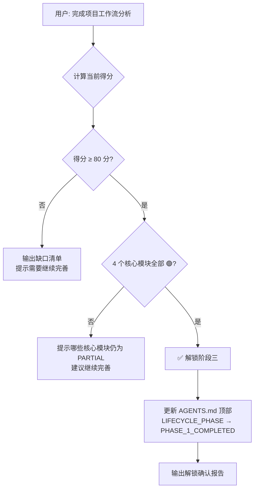
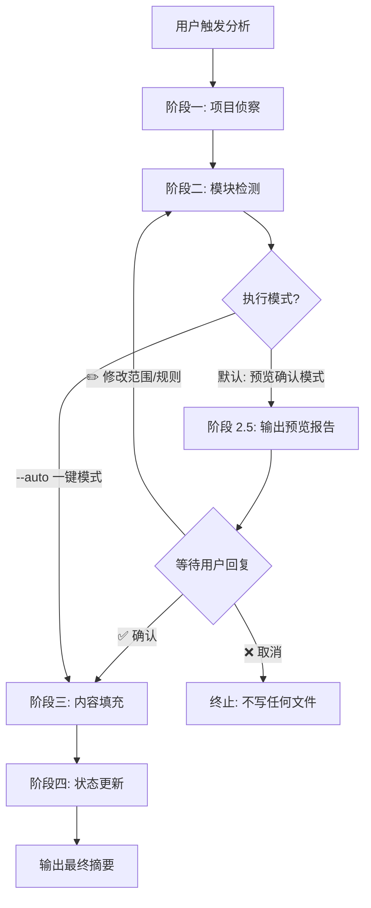

# 工作流分析器指令

> 本文件定义了项目工作流自动分析的完整指令，任何 AI Agent 均可根据此指令执行分析任务。

---

## 概述

本指令用于自动分析项目的开发工作流，扫描项目文件、检测配置，并将分析结果填充到 `.agent-workflow/workflows/` 下的文档模板中，同时更新状态标记。

## 触发方式

当用户发出以下类型的指令时，Agent 应执行本分析流程：

- "分析项目工作流" / "Analyze project workflows"
- "填充工作流文档" / "Fill workflow documentation"
- "分析编译流程" / "Analyze build process"（单模块分析）
- "分析测试流程" / "Analyze testing process"（单模块分析）
- "查看工作流完善度" / "完善 <模块名>"（阶段一完善缺口补充）
- "完成项目工作流分析"（宣告阶段一完成，触发解锁检查）

### 执行模式（重要）

本分析器有两种执行模式，**默认必须使用「预览确认模式」**：

| 模式 | 触发方式 | 行为 |
|------|---------|------|
| **预览确认模式**（默认） | `分析项目工作流` / `分析编译流程` 等不带参数的指令 | 完成阶段一、二后，**必须先向用户输出预览报告并等待确认**，得到 ✅ 后才进入阶段三写入 |
| **一键自动模式** | 指令末尾显式追加 `--auto` 或用户明确说"直接写入 / 跳过确认" | 跳过预览确认，连续执行四个阶段直到结束 |

> ⚠️ **硬性约束**：除非用户显式触发一键模式，否则**严禁**在未经用户确认前执行阶段三的文件写入。

## 分析模式

### 整体分析（默认）

分析所有模块，按序号顺序逐一执行。

### 单模块分析

仅分析用户指定的模块。**单模块分析同样遵循预览确认模式**：检测完成后先向用户输出该模块的预览报告（检测发现摘要 + 将写入内容概要 + 待手动补充项），等待用户确认后再写入文件。`--auto` 参数同样适用于单模块分析以跳过确认。

## 模块映射表

| 模块名称 | ID | 文件 |
|---|---|---|
| 项目说明 | project-overview | 01-project-overview.md |
| 规则限制 | rules-constraints | 02-rules-constraints.md |
| 开发流程 | development-workflow | 03-development-workflow.md |
| 编译流程 | build-process | 04-build-process.md |
| 测试流程 | testing-process | 05-testing-process.md |
| 发布流程 | release-process | 06-release-process.md |
| Bug排查修复 | bug-fixing | 07-bug-fixing.md |
| 代码Review | code-review | 08-code-review.md |
| 模块分析 | module-analysis | 09-module-analysis.md |
| 代码优化 | code-optimization | 10-code-optimization.md |
| 分支提交 | branch-commit | 11-branch-commit.md |
| PR提交 | pull-request | 12-pull-request.md |
| CI/CD流程 | ci-cd-pipeline | 13-ci-cd-pipeline.md |
| 工作流自检（META） | workflow-self-check | 14-workflow-self-check.md |
| 模块台账（阶段二强化） | module-inventory | 15-module-inventory.md |
| 业务调用链推导（阶段二） | call-chain-derivation | 16-call-chain-derivation.md |
| 模块分层（GROUP_META v1.9） | module-layer | 无独立文件，规则定义在 `analyzer-instructions.md#表-h--模块分层元数据` |
| 链路档案落档（v1.8） | call-chain-persistence | 16-call-chain-derivation.md#step-6--落档规范v18-新增硬性 |

> 🔧 **元流程说明**：14 工作流自检是常驻审计能力，**不参与**本分析器的重写流程：
>
> - 不读取 `DETECTION_HINTS`，不检测项目侧文件
> - 不计入[阶段一完善度评分](./lifecycle.md)，STATUS 永远为 `DONE`（语义为"模板自带能力"，非"项目侦察后已完成"）
> - `LAST_ANALYZED` 字段固定为 `N/A`，**不写入实际日期**（避免误导用户以为做过项目侦察）；`AGENTS.md` 状态总览表中对应行的"最后更新"列亦填 `N/A`，状态显示为"🟢 模板自带"
> - 独立触发词：`启动工作流自检` / `自检工作流` / `自检 <模块名>` / `自检 关键流`——详见该文件本身的 SOP

---

## 约束常量表（SSOT · Single Source of Truth）

> 本节是**模板内所有跨文件复用的"约束常量"的唯一定义处**。
>
> **使用契约**：其他文件（`AGENTS.md`、`workflows/`、`templates/`、`tasks/` 等）若需引用本表中的值，必须在引用点附近以注释形式注明`<!-- 约束源：analyzer-instructions.md#约束常量表 -->`，**严禁在他处重新定义同一约束**。维护者新增/修改约束时，统一改本表，再按附录 F「常量同步清单」检查引用点。
>
> 14 自检流程的 D5 维度新增 6 条机械规则（见 `workflows/14-workflow-self-check.md` D5.E1 ~ D5.E6）会按本表机械校验各引用点。

### 表 A · 任务模板元数据（TASK_META）

| 常量名 | 值 | 主要引用点 |
|--------|-----|-----------|
| `RELATED_WORKFLOWS_FEATURE` | `03,04,05,08,11,12,13` | `templates/task-feature-template.md` 头部、`tasks/_example.md` 头部 |
| `RELATED_WORKFLOWS_BUGFIX`  | `07,04,05,08,11,12,13` | `templates/task-bugfix-template.md` 头部 |
| `RELATED_WORKFLOWS_REFACTOR`| `10,08,04,05,11,12,13` | `templates/task-refactor-template.md` 头部 |
| `TASK_STATUS_ENUM` | `PLANNING / IN_PROGRESS / BLOCKED / DONE / ABANDONED` | `AGENTS.md` 任务执行 SOP、3 个 task 模板 `<!-- TASK_HINTS -->`、`tasks/tasks-guide.md` 状态字段说明 |
| `TASK_TYPE_ENUM` | `feature / bugfix / refactor` | 同上 |
| `RISK_STATUS_ENUM` | `跟进中 / 已解除` | `AGENTS.md` Step 2 第 4~5 项、3 个 task 模板的「风险与阻塞」表头 quote、`tasks/_example.md` |
| `TASK_FILE_NAMING` | `YYYYMMDD-<kebab-slug>.md` | `AGENTS.md` Step 1.3、`tasks/tasks-guide.md` 命名规范、`templates/templates-guide.md` 新增任务步骤 |
| `TASK_ARCHIVE_PATH` | `tasks/_archive/<YYYY-MM>/` | `AGENTS.md` Step 4/5、3 个 task 模板验收清单末项、`tasks/tasks-guide.md` SOP 速查 |
| `BLOCKED_TO_DONE_FORBIDDEN` | `BLOCKED 不得直接跳 DONE，必须先回 IN_PROGRESS 或走 ABANDONED` | `AGENTS.md` 硬性约束 |

### 表 B · 阶段一完善度评分（LIFECYCLE_SCORING）

| 常量名 | 值 | 唯一定义处 |
|--------|-----|-----------|
| `CORE_MODULES` | `01, 02, 03, 11`（每项 20 分） | [`lifecycle.md`](./lifecycle.md) |
| `EXTENDED_MODULES` | `04, 05, 07, 08, 12`（每项 4 分） | 同上 |
| `UNLOCK_THRESHOLD` | `80`（且核心模块全部 🟢 DONE） | 同上 |
| `UNLOCK_DECLARATION` | `完成项目工作流分析` | 同上 |
| `LIFECYCLE_PHASES` | `PHASE_1_INITIALIZING / PHASE_1_COMPLETED / PHASE_3_OPERATIONAL` | [`lifecycle.md`](./lifecycle.md)、`AGENTS.md` 顶部元数据 |

> 本表仅为**索引引用**，避免本文件与 `lifecycle.md` 双源维护；具体计分细节以 `lifecycle.md` 为准。

### 表 C · 关键流 8 跳（KEY_FLOW）

| 跳 | 上游 | 下游 | 衔接处 |
|:--:|------|------|--------|
| 1 | 需求理解（task） | SOP Step 4 归档动作 | task 模板 Step「完成归档动作（参考 AGENTS.md「Step 4」）」 |
| 2 | SOP Step 4 归档 | 11 分支创建 | task 模板 Step「提交分支（归档动作与代码主体一同 commit + push，参考 `workflows/11-branch-commit.md`）」 |
| 3 | 11 分支 | 04 编译 | task 模板 Step「本地编译通过（参考 `workflows/04-build-process.md`）」 |
| 4 | 04 编译 | 05 测试用例 | task 模板 Step「单元测试覆盖」 |
| 5 | 05 用例 | 05 运行测试 | task 模板 Step「本地测试通过（参考 `workflows/05-testing-process.md`）」 |
| 6 | 05 测试 | 11 提交 | task 模板 Step「提交分支」 |
| 7 | 11 提交 | 12 PR | task 模板 Step「创建 PR（参考 `workflows/12-pull-request.md`）」 |
| 8 | 12 PR | 13 CI + 合入 | task 模板 Step「CI 通过 + PR 合入主干（参考 `workflows/13-ci-cd-pipeline.md`）」 |

> 唯一详细定义处：[`workflows/14-workflow-self-check.md`](./workflows/14-workflow-self-check.md) Step 3。本表是**速查索引**，task 模板 Step List 必须显式包含上表「衔接处」列描述的引用语，否则 D4/D5 自检会判失败。

### 表 D · 触发指令词典（COMMANDS）

| 指令 | 所属阶段 | 行为入口 |
|------|:-------:|---------|
| `分析项目工作流` / `分析项目工作流 --auto` | 阶段一 | analyzer-instructions「触发方式」+「执行模式」 |
| `分析编译流程` / `分析测试流程` / `分析 <模块名>` | 阶段一（单模块） | 同上 |
| `查看工作流完善度` | 阶段一 | analyzer-instructions「完善缺口交互流程」 |
| `完善 <模块名>` | 阶段一 | 同上 |
| `完成项目工作流分析` | 阶段一 → 解锁阶段三 | analyzer-instructions「阶段一解锁检查」 |
| `分析所有业务模块` / `分析 <名> 模块` / `完善 <名> 模块` | 阶段二 | 09 模块分析流程 |
| `创建任务: <描述>` / `创建任务: <描述> --force` | 阶段三 | `AGENTS.md`「📋 任务执行 SOP」Step 0 ~ 1 |
| `查看进行中的任务` | 阶段三 | `AGENTS.md`「📋 进行中的任务」动态视图 |
| `继续任务` / `继续任务 <task-id>` | 阶段三 | `AGENTS.md` Step 3 中断恢复 |
| `归档任务 <task-id>` | 阶段三 | `AGENTS.md` Step 4 |
| `废弃任务 <task-id>` | 阶段三 | `AGENTS.md` Step 5 |
| `启动工作流自检` / `自检工作流` / `Workflow self-check` | 治理（不占阶段） | `workflows/14-workflow-self-check.md` |
| `自检 <模块名>` / `自检 关键流` | 治理 | 同上 |
| `建立模块台账` / `初始化模块台账` | 阶段二（台账） | `workflows/15-module-inventory.md` Step 3 |
| `刷新模块台账` / `更新所有模块台账` | 阶段二（台账） | `workflows/15-module-inventory.md` Step 5 |
| `更新 <模块名> 模块台账` / `刷新最近改动的模块台账` | 阶段二（台账） | 同上 |
| `检查模块台账时效性` / `体检模块台账` | 治理（台账） | `workflows/15-module-inventory.md` Step 6 |
| `画出 <入口> 的调用链` / `<业务> 从入口到落库的全流程` | 阶段二（链路） | `workflows/16-call-chain-derivation.md` Step 2.1 |
| `分析 <模块.接口> 的影响面` / `如果我改 <接口> 会影响谁` | 阶段二（链路） | `workflows/16-call-chain-derivation.md` Step 2.2 |
| `谁写入了 <表名/topic>` / `<资源> 的所有调用来源` | 阶段二（链路） | `workflows/16-call-chain-derivation.md` Step 2.3 |
| `刷新 topic 反查表` | 阶段二（链路） | `workflows/16-call-chain-derivation.md` Step 3 + 15 Step 5.4 |
| `列出已推导的调用链` / `查看调用链档案` | 阶段二（链路 v1.8） | `chains/index.md` + `workflows/16-call-chain-derivation.md` Step 7 |
| `刷新调用链档案 <slug>` | 阶段二（链路 v1.8） | `workflows/16-call-chain-derivation.md` Step 7 |
| `确认调用链 <slug>` | 阶段二（链路 v1.8） | `workflows/16-call-chain-derivation.md` Step 6.4 STATUS 状态机 |
| `作废调用链 <slug>` | 阶段二（链路 v1.8） | `workflows/16-call-chain-derivation.md` Step 6.4 |
| 推导命令末尾追加 `--no-persist` | 阶段二（链路 v1.8） | `workflows/16-call-chain-derivation.md` Step 6.6 临时推导例外 |
| `查看自检报告` / `忽略缺陷 #N` | 治理 | 同上 |

> 凡新增触发词必须先在本表登记，再在对应入口文件实现；其他文件如 `AGENTS.md`「快速开始」、`guide.md`、各 `*-guide.md` 提及指令时仅复用文字，不得另起定义。

### 表 E · 任务模板章节结构（TASK_SECTIONS）

| 模板 | 章节数 | 验收清单位置 | 章节序列 |
|------|:------:|:-----------:|---------|
| `task-feature-template.md` | 7 | 第 7 节 | 需求理解 → 影响范围 → 实施计划 → 关键决策 → 进度日志 → 风险与阻塞 → **验收清单** |
| `task-bugfix-template.md`  | 8 | 第 8 节 | 问题描述 → 复现步骤 → 根因分析 → 修复计划 → 关键决策 → 进度日志 → 风险与阻塞 → **验收清单** |
| `task-refactor-template.md`| 8 | 第 8 节 | 重构目标 → 影响范围 → 实施计划 → 关键决策 → 进度日志 → 风险与阻塞 → 指标对比 → **验收清单** |

> 三种任务结构本就不同，**不强行对齐章节数**；但模板顶部 quote 必须显式标注章节数与验收清单为最后一节（D5.E5 自检规则会校验）。

### 表 F · 分叉语义常量表（FORK_SEMANTICS）（v1.7 新增）

> 16 号工作流推导调用链时对分叉分支的**统一语义标签**。任何分叉图的边标签 / 档案中的分叉声明都必须使用下列枚举值，不得自创。

| 常量名 | 枚举值 | 主要引用点 |
|--------|-------|-----------|
| `FORK_TYPE_ENUM` | `conditional / sync fan-out / async fan-out / polymorphic / event-bus / normal` | `workflows/16-call-chain-derivation.md` Step 2.5、`templates/module-template.md`「上游依赖」段 |
| `FORK_EDGE_PREFIX` | `sync:` （同步预约） / `async:` （异步预约）/ `possible:` （多态不确定）/ `cycle-back` （成环回边） | 16 Step 2.5.3 mermaid 图形约定 |
| `FORK_MERMAID_SYNTAX` | 条件分叉必用 `alt/else`；同步扇出用实线箭头 `->>`；异步扇出用虚线箭头 `--)` 或 `-->>`；多态/事件总线额外在目标上加 `Note over X: ⚠️ 多态分叉 / 事件总线断点` | 16 Step 2.5.3 |
| `CYCLE_DETECTION_RULE` | 展开时若 `current ∈ path` → 画 `cycle-back` 边并标注 `⚠️ 成环`，终止该分支；若 `current ∈ visited 但 ∉ path` → 标注 `↩ 已访问`，不二次展开 | 16 Step 2 算法、Step 2.4 |

> **D5 一致性声明**：`FORK_TYPE_ENUM` 与 `FORK_EDGE_PREFIX` 一旦新增枚举值，必须同步到本表与 16 Step 2.5，**不得**在档案文件或模板中引入未登记的分叉类型。

### 表 G · 链路档案元数据（CHAIN_META）（v1.8 新增，v1.9 升级）

> 16 号工作流 v1.8 落档协议的唯一定义处。链路档案 `chains/*.md` 头部字段、命名、状态未登记到本表不得使用。

| 常量名 | 值 | 主要引用点 |
|--------|-----|-----------|
| `CHAIN_STATUS_ENUM` | `DERIVED / VERIFIED / STALE / ABANDONED` | `workflows/16-call-chain-derivation.md` Step 6.4、`chains/index.md` 状态列、`chains/chains-guide.md` 生命周期图 |
| `CHAIN_TYPE_ENUM` | `forward / reverse / data-lookup` | `workflows/16-call-chain-derivation.md` Step 6.1、`templates/chain-template.md` 头部 |
| `CHAIN_FILE_NAMING` | `<chain-type>-<entry-slug>.md`（entry-slug 使用 kebab-case） | `workflows/16-call-chain-derivation.md` Step 6.1 |
| `CHAIN_SNAPSHOT_FORMAT` | **v1.9：**`<group>/<module-name>@<YYYY-MM-DD>` 或 `<module-name>@<YYYY-MM-DD>`（顶层单模块），多个用逗号分隔 | `workflows/16-call-chain-derivation.md` Step 6.3、7.1 |
| `CHAIN_STALE_TRIGGER_RULE` | 对比 `SOURCE_MODULES_SNAPSHOT` 与当前模块档案的 `LAST_ANALYZED`，任一不一致 → STALE（仅提示不自动重推）；**v1.9 匹配优先按带路径 `<group>/<module>` 完整匹配，退化后按单模块名匹配** | `workflows/16-call-chain-derivation.md` Step 7.1、7.2；`workflows/15-module-inventory.md` Step 5.5 级联失效 |
| `CHAIN_PERSIST_DEFAULT` | `on`（默认落档）；用户显式追加 `--no-persist` 可关闭 | `workflows/16-call-chain-derivation.md` Step 5、6.6 |
| `CHAIN_VERIFY_TRIGGER` | 仅用户显式触发（`确认调用链 <slug>` / 回复“链路正确已核对”）方可 `DERIVED → VERIFIED`；Agent 不得自行升级 | `AGENTS.md` 业务调用链档案硬约束、`workflows/16-call-chain-derivation.md` Step 6.4 |
| `CHAIN_REVERSE_INDEX_RULE`（v1.9 新增） | Step 6 每次落档后必须反向向沿途模块档案头部 `INVOLVED_CHAINS` 注入 slug，并同步更新 Group 档案的「涉及链路」表；ABANDONED 时同步移除 | `workflows/16-call-chain-derivation.md` Step 6.7 |

> **一致性声明**：`chains/*.md` 中 STATUS / 命名 / 快照格式不合规者 → 15 Step 5.5 扫描与 16 Step 0.4 命中检查均会失效。新增常量先改本表，再同步到 16 与模板。

### 表 H · 模块分层元数据（GROUP_META）（v1.9 新增）

> 15 号工作流 v1.9 分层结构的唯一定义处。模块档案的层级关系、目录命名、Group 阈值未登记到本表不得使用。

| 常量名 | 值 | 主要引用点 |
|--------|-----|-----------|
| `MODULE_LAYER_DEPTH` | `2`（硬性上限）：只支持 `modules/<group>/<module>.md`，禁止 3 层及以上嵌套 | `workflows/15-module-inventory.md` Step 1.4 |
| `GROUP_THRESHOLD` | `SUB_MODULE_COUNT ≥ 3` 且同时满足内聚性 + 对外收敛三条判定 → 建 Group；不满足 → 顶层单模块 | `workflows/15-module-inventory.md` Step 1.4 |
| `GROUP_FILE_NAMING` | Group 目录下索引文件**必须**命名为 `group.md`（不得变体） | `templates/module-group-template.md`、`workflows/15-module-inventory.md` Step 3 |
| `MODULE_HEADER_FIELDS` | 模块档案头部必填字段：`MODULE / MODULE_GROUP / INVOLVED_CHAINS / STATUS / LAST_ANALYZED / ANALYZER_VERSION`（v1.9 新增 MODULE_GROUP + INVOLVED_CHAINS） | `templates/module-template.md` |
| `GROUP_HEADER_FIELDS` | Group 档案头部必填字段：`MODULE_GROUP / STATUS / LAST_ANALYZED / SUB_MODULE_COUNT / ANALYZER_VERSION` | `templates/module-group-template.md` |
| `INVOLVED_CHAINS_FORMAT` | 链路 slug 逗号分隔，无则填 `-`；维护方为 16 Step 6.7，消费方为 Agent 加载模块时 | `templates/module-template.md`、`workflows/16-call-chain-derivation.md` Step 6.7 |
| `THREE_LEVEL_LOAD_PROTOCOL` | L1 读 `modules/index.md` → L2 命中 Group 后读 `<group>/group.md` → L3 读具体模块档案；顶层单模块直达 L3 | `workflows/16-call-chain-derivation.md` Step 1.2 |
| `TOP_INDEX_SCOPE` | `modules/index.md` **只列** Group + 顶层单模块，**不列**子模块（子模块清单在 `<group>/group.md`） | `modules/index.md` |

> **一致性声明**：模块目录层级不合规者 → 15 Step 5.5（链路失效匹配）与 16 Step 6.3（快照写入）都会行为异常。

---

## 阶段一生命周期管理

> 本节定义阶段一（项目工作流分析）的完善缺口交互机制、完善度评分与解锁逻辑。

### 完善度评分计算

每次分析完成后，Agent 自动按以下规则计算阶段一完善度得分：

| 类别 | 模块 | 满分 | 计分规则 |
|:----:|------|:---:|--------|
| **核心模块** | 01 项目说明 | 20 | 🟢 DONE=20 / 🟡 PARTIAL=10 / 🔴 TODO=0 |
| | 02 规则限制 | 20 | 同上 |
| | 03 开发流程 | 20 | 同上 |
| | 11 分支提交 | 20 | 同上 |
| **扩展模块** | 04 编译流程 | 4 | 同上（满分 4 分） |
| | 05 测试流程 | 4 | 同上 |
| | 07 Bug排查修复 | 4 | 同上 |
| | 08 代码Review | 4 | 同上 |
| | 12 PR提交 | 4 | 同上 |
| **合计** | | **100** | |

**评分后必须输出完善度报告**（格式参考 `AGENTS.md` 的「完善度评分示例」）。

### 完善缺口交互流程

当用户输入 `查看工作流完善度` 或分析完成后，Agent 必须：

1. **扫描所有 workflow 文件**，读取每个文件的 `STATUS` 元数据
2. **计算当前得分**，输出完善度报告
3. **输出缺口清单**：列出所有 🔴 TODO 和 🟡 PARTIAL 模块，并附带结构化追问：

```
## 📋 阶段一完善缺口清单

以下模块需要补充信息：

🔴 **11 分支提交**（0/20 分）
  → 未检测到分支命名规范配置。请问：
    - 项目使用什么分支模型？（Git Flow / Trunk-based / 自定义）
    - 分支命名有什么规范？（如 feature/xxx、fix/xxx）
    - Commit 消息有格式要求吗？（如 Conventional Commits）
  → 可输入 `完善 分支提交` 开始补充，或直接回答上述问题。

🟡 **03 开发流程**（10/20 分）
  → 已检测到启动命令，但缺少环境变量说明。请问：
    - 项目有哪些必要的环境变量？（.env.example 中未找到）
    - 本地开发有特殊的前置步骤吗？
  → 可输入 `完善 开发流程` 开始补充。
```

4. **支持单模块补充**：用户输入 `完善 <模块名>` 时，Agent 执行以下步骤：
   1. 针对该模块发起专项追问，收集用户补充的信息
   2. 整理收集到的信息，向用户展示**将要写入的内容摘要**，并询问确认：
      ```
      📝 即将更新「XX 模块」，写入以下内容：
      - 分支模型：Git Flow
      - 分支命名规范：feature/xxx、fix/xxx、hotfix/xxx
      - Commit 格式：Conventional Commits（type(scope): desc）
      
      确认写入？（✅ 确认 / ✏️ 修改 / ❌ 取消）
      ```
   3. 用户确认后写入对应 workflow 文件，并重新计算完善度得分
   4. 输出更新结果：文件路径 + 新得分 + 是否还有其他缺口

### 阶段一解锁检查

当用户输入 `完成项目工作流分析` 时，Agent 执行以下检查：



**解锁确认报告格式：**

```
🎉 阶段一完成！工作流完善度：XX/100 分

✅ 核心模块全部完成：01 项目说明 / 02 规则限制 / 03 开发流程 / 11 分支提交
📦 扩展模块：已完成 X/5 个

阶段三（开发维护任务）已解锁！
现在可以使用 `创建任务: <描述>` 开始研发任务。
```

### 阶段三前置检查

当用户输入 `创建任务: <描述>` 时，Agent 必须先检查 `AGENTS.md` 顶部的 `LIFECYCLE_PHASE`：

- `PHASE_1_COMPLETED` 或 `PHASE_3_OPERATIONAL` → ✅ 正常创建任务
- `PHASE_1_INITIALIZING` → ⚠️ 软阻断，输出以下提示：

```
⚠️ 阶段一尚未完成（当前完善度：XX/100 分）

建议先完善项目工作流分析，以确保任务执行更准确。

你可以：
  1. 输入 `查看工作流完善度` 查看缺口并继续完善
  2. 输入 `创建任务: <描述> --force` 强制跳过检查直接创建（不推荐）

> 💡 阶段一完成后，Agent 能更准确地引用项目规范（分支命名、代码规范、测试要求等）来执行任务。
```

---

## 分析流程



### 阶段一：项目侦察

在分析各模块之前，先执行全局扫描以建立上下文：

1. **读取项目根目录**，了解整体结构
2. **识别项目类型**，检查关键指示文件：
   - `package.json` → Node.js/前端项目
   - `go.mod` → Go 项目
   - `Cargo.toml` → Rust 项目
   - `pom.xml` / `build.gradle` → Java 项目
   - `requirements.txt` / `pyproject.toml` / `Pipfile` → Python 项目
   - `CMakeLists.txt` / `Makefile` → C/C++ 项目
   - `*.sln` / `*.csproj` → .NET 项目
   - `mix.exs` → Elixir 项目
   - `pubspec.yaml` → Dart/Flutter 项目
   - `Gemfile` → Ruby 项目
3. **记录技术栈**，供后续各模块分析使用

### 阶段二：模块检测

对每个模块（或用户指定的单个模块）执行检测：

1. **读取工作流文件**（`.agent-workflow/workflows/` 下对应文件）
2. **提取 DETECTION_HINTS**（文件底部的 HTML 注释块），其中包含需要检查的文件、目录和模式
3. **执行检测规则**，搜索 DETECTION_HINTS 中列出的文件和目录
4. **收集发现**，对每个检测到的项目读取内容并提取相关信息

### 阶段 2.5：预览确认（默认模式必须执行）

> 仅当用户使用 `--auto` 一键模式时可跳过本阶段。

阶段二完成后、阶段三写入文件**之前**，Agent 必须向用户输出**预览报告**并显式等待用户回复：

**预览报告必须包含：**

1. **影响范围清单**：本次将被修改的文件路径完整列表（含 `.agent-workflow/workflows/*.md` 与 `AGENTS.md`）
2. **每个模块的写入摘要**：表格形式列出 `模块名 | 状态预判 (DONE/PARTIAL) | 关键检测发现 (≤3 行) | 是否有未检测项`
3. **风险提示**：占位内容（含 "⚠️ 待实现"）将被实际事实覆盖；已被人工编辑的部分会被保留
4. **询问用户决策**：明确给出三个选项：
   - ✅ **确认写入**：进入阶段三
   - ✏️ **修改范围**：用户可指定排除模块、追加规则、限定语言等，Agent 据此重做阶段二
   - ❌ **取消**：终止流程，不写任何文件

**示例预览报告格式：**

```
## 📝 工作流分析预览（待确认）

以下文件将被修改（共 N 个）：
- AGENTS.md（状态总览表）
- .agent-workflow/workflows/01-project-overview.md
- .agent-workflow/workflows/04-build-process.md
- ...

| 模块 | 状态预判 | 关键检测发现 | 待手动补充 |
|------|---------|-------------|-----------|
| 项目说明 | 🟢 DONE | Node.js + React 18 + TypeScript | - |
| 编译流程 | 🟡 PARTIAL | webpack + npm run build | 跨平台构建命令 |
| ... | ... | ... | ... |

请回复：✅ 确认写入 / ✏️ 修改范围（说明如何修改） / ❌ 取消
```

**用户未明确确认前，绝不执行阶段三。** 若用户回复模糊（如 "嗯" / "好"），需再次明确确认；若回复 "修改" 但未给出具体修改项，需追问澄清。

### 阶段三：内容填充

> 仅在用户已确认或使用 `--auto` 模式时执行。

对每个已分析的模块：

1. **替换内容占位块** — 找到 `<!-- CONTENT_START: xxx -->` ... `<!-- CONTENT_END: xxx -->` 块，将占位内容替换为实际发现
2. **保留结构** — 保持所有章节标题、表头和结构元素不变
3. **仅使用事实信息** — 只填写实际检测到的内容；未检测到的部分替换为 "未检测到相关配置，建议手动补充"
4. **格式一致** — 使用与模板相同的 Markdown 格式（表格、代码块、列表）

### 阶段四：状态更新

内容填充完成后：

1. **更新模块文件元数据**：
   - `<!-- STATUS: TODO -->` → `<!-- STATUS: DONE -->`（全部填充）或 `<!-- STATUS: PARTIAL -->`（部分填充）
   - 设置 `<!-- LAST_ANALYZED: YYYY-MM-DD -->` 为当前日期
2. **更新 AGENTS.md 工作流程状态总览表**：
   - 状态列从 "🔴 待实现" 改为 "🟢 已完成" 或 "🟡 部分完成"
   - 更新 "最后更新" 列为当前日期（对应各 workflow 文件的 `LAST_ANALYZED` 字段）
3. **更新 AGENTS.md「🔰 当前阶段状态」面板**：
   - 重新计算完善度得分（按 lifecycle.md 评分规则）
   - 更新「完善度得分」行为最新分值（如 `54 / 100 分`）
   - 更新「上次分析时间」行为当前日期
   - 若得分已 ≥ 80 分且 4 个核心模块全部 🟢，将「阶段三解锁」行更新为 `🟢 已解锁（可使用 完成项目工作流分析 宣告完成）`

---

## 各模块检测规则

### 01 - 项目说明 (project-overview)

**主要检测目标：**
- README.md — 提取项目名称、描述、架构信息
- package.json / go.mod / Cargo.toml / pom.xml / pyproject.toml — 提取名称、版本、描述、依赖
- .nvmrc / .python-version / .tool-versions — 提取运行时版本要求
- tsconfig.json / webpack.config.* / vite.config.* — 识别前端工具链
- Dockerfile / docker-compose.yml — 识别容器化方案
- 顶层目录结构 — 梳理模块组织
- CODEOWNERS — 提取模块负责人（用于 main_developers）
- git log (--format='%ae %an') — 统计每位作者的提交数，识别主要贡献者

**提取信息：** 项目名称、描述、技术栈、框架版本、核心依赖、目录结构概览
**主要开发者：** 合并 git log 的高频提交者和 CODEOWNERS 条目；填充"主要开发者"表格（姓名、负责模块、角色备注）。此列表可用于 PR 流程中自动推荐审阅者。

### 02 - 规则限制 (rules-constraints)

**主要检测目标：**
- .eslintrc* / eslint.config.* — JavaScript/TypeScript 代码检查规则
- .prettierrc* / prettier.config.* — 代码格式化规则
- .editorconfig — 编辑器配置
- .clang-format / .clang-tidy — C/C++ 格式化
- pylintrc / .flake8 / pyproject.toml[tool.pylint] — Python 代码检查
- .golangci.yml — Go 代码检查
- rustfmt.toml / clippy.toml — Rust 格式化/检查
- .stylelintrc* — CSS/SCSS 检查
- tsconfig.json (strict 设置) — TypeScript 严格度
- .browserslistrc — 浏览器兼容性目标

**提取信息：** 代码检查配置、格式化规则、严格度级别、自定义规则、忽略模式

### 03 - 开发流程 (development-workflow)

**主要检测目标：**
- Dockerfile / docker-compose.yml / .devcontainer/ — 容器化开发环境
- Makefile (dev/run/serve 目标) — 开发命令
- package.json (scripts.dev, scripts.start, scripts.serve) — NPM 开发脚本
- .env.example / .env.development — 环境变量模板
- .vscode/settings.json / .vscode/extensions.json — IDE 配置
- .vscode/launch.json — 调试配置

**提取信息：** 环境搭建步骤、安装命令、运行命令、开发服务器 URL/端口、环境变量、推荐 IDE 扩展

### 04 - 编译流程 (build-process)

**主要检测目标：**
- Makefile / CMakeLists.txt / meson.build / BUILD.bazel — 原生构建系统
- build.gradle / pom.xml — Java 构建工具
- package.json (scripts.build) / webpack.config.* / vite.config.* — 前端构建工具
- Cargo.toml / build.rs / .cargo/config.toml — Rust + 交叉编译目标
- pyproject.toml (build-system) / setup.py — Python 构建配置
- toolchain.cmake / cross-*.cmake — CMake 交叉编译工具链文件
- build-all.sh / build-cross.sh / build-platforms.sh — 多平台构建脚本
- dist/ / build/ / out/ / target/ / bin/ / release/ — 构建输出目录
- go.mod + GOOS/GOARCH 环境变量模式 — Go 交叉编译

**提取信息：** 增量构建命令、全量构建命令、清理命令、重置构建命令、本地快速构建命令、跨平台构建命令、构建工具名称和版本、输出路径、编译标志

### 05 - 测试流程 (testing-process)

**主要检测目标：**
- test/ / tests/ / __tests__/ / spec/ — 测试目录
- jest.config.* / vitest.config.* / pytest.ini / conftest.py — 测试框架配置
- cypress.config.* / playwright.config.* — E2E 测试配置
- package.json (scripts.test*) / Makefile (test 目标) — 测试命令
- *_test.go / *_test.rs — 测试文件模式
- .coveragerc / .nycrc / .c8rc — 覆盖率配置

**提取信息：** 测试框架、测试命令、测试目录结构、覆盖率阈值、E2E 测试配置

### 06 - 发布流程 (release-process)

**主要检测目标：**
- CHANGELOG.md / RELEASES.md — 变更日志
- VERSION / version.txt / package.json (version) — 版本追踪
- .release-it.json / release.config.js / .changeset/ — 发布自动化
- .gitlab-ci.yml / .github/workflows/*release* — CI/CD 发布流水线
- Dockerfile / kubernetes/ / helm/ / terraform/ — 部署配置
- .env.production / .env.staging — 环境配置
- vercel.json / netlify.toml / fly.toml — 平台部署配置

**提取信息：** 版本方案、发布命令、部署目标、环境配置、CI/CD 流水线阶段

### 07 - Bug排查修复 (bug-fixing)

**主要检测目标：**
- .vscode/launch.json / .idea/runConfigurations/ — 调试配置
- log4j*.xml / logback.xml / logging.conf — 日志框架配置
- .sentryclirc / sentry.properties — 错误追踪
- 包依赖：winston/pino/sentry-sdk/zap/logrus — 日志库
- logs/ / log/ — 日志目录
- .gdbinit / .lldbinit — 调试器配置

**提取信息：** 日志框架、日志配置、调试设置、错误追踪平台、监控工具

### 08 - 代码Review (code-review)

**主要检测目标：**
- CODEOWNERS — 代码所有权
- .github/PULL_REQUEST_TEMPLATE.md — PR 模板
- .pre-commit-config.yaml / lint-staged 配置 — 提交前检查
- sonar-project.properties — 代码质量平台
- .danger.js / dangerfile.ts — 自动化审查工具
- CI 配置中的 lint/review 任务 — 自动化 CI 检查

**提取信息：** CODEOWNERS 规则、PR 模板内容、自动化检查列表、代码质量工具

### 09 - 模块分析 (module-analysis)

> 此工作流是一个**操作流程**，而非静态展示。触发后，Agent 扫描指定模块并将结果写入 `.agent-workflow/modules/<module-name>.md`。

**触发方式：** 用户要求"分析模块 X"或"分析所有模块"。

#### 第一步：识别工程结构类型

在扫描模块之前，**必须先判断工程结构类型**，不同结构的模块边界划分方式不同：

| 工程结构类型 | 识别依据 | 模块边界划分方式 |
|------------|---------|---------------|
| **Monorepo**（多包） | `lerna.json` / `nx.json` / `turbo.json` / `pnpm-workspace.yaml` / `package.json(workspaces)` / `go.work` / `Cargo.toml(workspace.members)` / `settings.gradle(include)` | 每个子包/子项目 = 一个模块，路径即为模块根目录 |
| **按功能目录划分**（单体应用） | 顶层存在 `src/` 或 `lib/`，其下按功能命名子目录（如 `auth/`、`payment/`、`user/`） | `src/<feature>/` 或 `lib/<feature>/` 下的每个功能目录 = 一个模块 |
| **按层划分**（MVC/分层架构） | 顶层或 `src/` 下存在 `controller/`、`service/`、`dao/`、`repository/`、`model/` 等层级目录 | 跨层的同一业务领域 = 一个模块（如 `user` 模块 = `controller/user` + `service/user` + `dao/user` 的集合） |
| **微服务**（多服务目录） | 顶层存在多个独立服务目录，每个目录下有独立的构建文件（`package.json` / `go.mod` / `pom.xml` 等） | 每个服务目录 = 一个模块 |
| **混合结构**（前后端同仓） | 顶层同时存在前端目录（`frontend/`、`web/`、`client/`）和后端目录（`backend/`、`server/`、`api/`） | 前端整体 / 后端整体各为一个顶层模块，其下再按功能细分子模块 |
| **扁平结构** | 所有源文件直接在根目录或 `src/` 下，无明显子目录划分 | 按文件命名前缀或功能聚类划分，或整体作为单一模块 |

> ⚠️ **同一项目可能混合多种结构**（如 Monorepo 内的某个子包本身是分层架构），需递归识别。

#### 第二步：确定模块文件归属

识别工程结构后，按以下规则确定**哪些文件属于同一个模块**：

**规则 A — Monorepo / 微服务 / 混合结构**：
- 模块根目录下的**所有文件**均归属该模块（含子目录）
- 相关文件列表：列出模块根目录下 2~3 层的关键文件（入口、核心逻辑、配置、测试），不需要穷举所有文件
- 格式：`路径（相对于项目根）— 说明`

**规则 B — 按功能目录划分**：
- `src/<feature>/` 下的所有文件归属该功能模块
- 若存在跨目录的共享文件（如 `src/shared/`、`src/common/`），在「依赖关系」中注明，不计入模块文件列表

**规则 C — 按层划分（分层架构）**：
- 同一业务领域跨多个层的文件**合并为一个模块**
- 相关文件列表需按层分组展示：
  ```
  controller/user.go       — HTTP 入口层
  service/user_service.go  — 业务逻辑层
  dao/user_dao.go          — 数据访问层
  model/user.go            — 数据模型
  ```
- 识别方式：在各层目录下查找同名或同前缀的文件（如 `user_controller`、`user_service`、`user_dao`）

**文件列表粒度规范**：
- ✅ 列出：入口文件、核心逻辑文件、对外接口定义文件、配置文件、测试文件（代表性的）
- ❌ 不列出：自动生成的文件（`*.pb.go`、`*.generated.ts`）、临时文件、与模块功能无关的工具脚本
- 文件数量上限：单模块相关文件列表不超过 **20 条**；超出时按重要性截取，末尾注明 `（共 N 个文件，仅列关键文件）`

#### 第三步：执行模块扫描

确定文件归属后，对每个目标模块执行：
1. 入口文件：index.* / main.* / mod.* / lib.* — 导出接口
2. import/include/require/use 模式 — 上游依赖
3. DB 调用 / HTTP 请求 / MQ 发布订阅 — 外部交互点
4. 已有 README 或文档注释 — 现有描述

#### 第四步：写入与索引更新

1. 将分析结果写入 `.agent-workflow/modules/<module-name>.md`
2. 保留手动编写的内容；仅覆盖自动检测的部分
3. **同步更新 `.agent-workflow/modules/index.md`**：
   - 若模块为新增：在索引表追加一行，填写 `模块ID / 模块名称 / 职责概述 / 状态 / 关键词 / 文件链接`
   - 若模块为更新：同步修改对应行的「职责概述」「关键词」「状态」字段
   - 关键词提取规则：模块英文名 + 核心功能词 + 关联实体名，英文逗号分隔，不超过 8 个
4. 向用户报告摘要（文件路径、发现的接口、依赖、需手动输入的项目）

**主要检测目标：**
- 顶层目录结构（1-2 层深度）
- lerna.json / nx.json / turbo.json / pnpm-workspace.yaml — Monorepo 配置
- package.json (workspaces) / go.work / Cargo.toml (workspace) — 工作区配置
- settings.gradle (include) — Java 多模块配置
- 各层目录（controller/ service/ dao/ repository/ model/）— 分层架构识别
- 入口文件：index.* / main.* / mod.* / lib.* — 模块入口点和导出符号
- Import/include 模式 — 模块依赖分析
- 外部交互模式 (DB/HTTP/MQ) — 数据流分析

**输出目标：** `.agent-workflow/modules/<module-name>.md`（每个模块一个文件）

### 10 - 代码优化 (code-optimization)

**主要检测目标：**
- sonar-project.properties / .codeclimate.yml — 代码质量工具
- webpack-bundle-analyzer / package.json (scripts.analyze) — 包分析
- .size-limit.json — 大小限制
- TODO/FIXME/HACK/XXX 注释 — 技术债务指标
- benchmark/ / bench/ / perf/ — 性能测试
- ESLint 复杂度规则 — 复杂度阈值

**提取信息：** 质量工具、TODO/FIXME 统计、包大小配置、性能基准、复杂度指标

### 11 - 分支提交 (branch-commit)

**主要检测目标：**
- .gitflow — Git Flow 配置
- commitlint.config.* / .commitlintrc* — 提交消息规则
- .czrc / .cz.json / package.json (commitizen) — Commitizen 配置
- .husky/ / .pre-commit-config.yaml / lefthook.yml — Git hooks
- Git 分支列表 — 分支命名模式
- 最近的 git log — 提交消息格式模式

**提取信息：** 分支模型、分支命名规范、提交消息格式、Git hooks 配置

### 12 - PR提交 (pull-request)

**主要检测目标：**
- .github/PULL_REQUEST_TEMPLATE.md — PR 模板
- CI 配置中的 pull_request 触发器 — PR 触发的 CI
- CODEOWNERS — 必要审阅者
- .mergify.yml / .kodiak.toml — 自动合并配置
- 分支保护配置

**提取信息：** PR 模板内容、CI 门禁检查、审批规则、合并策略、自动合并配置

### 13 - CI/CD流程 (ci-cd-pipeline)

**主要检测目标：**
- .gitlab-ci.yml / .github/workflows/ / Jenkinsfile — CI/CD 配置
- .coding-ci.yml / .travis.yml / .circleci/ — 其他 CI 平台
- docker-compose.yml / kubernetes/ / helm/ — 部署编排
- Makefile (ci/cd 相关目标) — CI/CD 命令

**提取信息：** CI/CD 平台、流水线阶段、触发条件、部署目标、环境变量管理

### 15 - 模块台账 (module-inventory)

> 此工作流是 09 的**补强与延续**，负责模块台账的粒度规范、反向调用扫描、持续维护、时效性保证。

**执行契约（与本分析器的关系）：**

- 15 是**阶段二**能力（业务模块台账），本分析器的阶段一（工作流侦察）扫描时**不主动触发** 15 的重写流程
- 15 的触发权在**用户显式指令**（见触发词典表 D）与 **Agent 自动挂钩**（见下）两处

**Agent 自动挂钩点（重要，全局适用）：**

| 挂钩位置 | Agent 应执行的动作 | 参照 |
|---------|-------------------|-----|
| 任何代码修改类任务**开始时** | 执行 `15-module-inventory.md` Step 4 台账使用协议：先查 `modules/index.md` → 命中模块 → 时效校验 → 加载档案 | [`03-development-workflow.md` Step 3.1](./workflows/03-development-workflow.md) |
| 任何代码修改类任务**完成前** | 执行 `15-module-inventory.md` Step 5 增量更新：刷新受影响模块档案 + `modules/index.md` 索引 | [`03-development-workflow.md` Step 10](./workflows/03-development-workflow.md) |
| 任何代码 commit **前** | 校验模块档案已同步（`LAST_ANALYZED` = 今日 + 时效状态 🟢），未通过禁止 `git add` | [`11-branch-commit.md` 提交代码前置校验](./workflows/11-branch-commit.md) |
| 加载模块档案**前** | 若档案 🟡/🔴 状态，先执行 Step 5 刷新再加载 | [`15-module-inventory.md` Step 6](./workflows/15-module-inventory.md) |

> ⚠️ **硬性约束**：以上四个挂钩点是**全局强制**的，不因任务类型（feature / bugfix / refactor）不同而豁免。违反 Step 5（任务完成前未刷台账）视为**流程违规**，任务不得报告完成。

**主要检测目标（仅在用户显式触发"建立/刷新模块台账"时使用）：**

- `.agent-workflow/modules/index.md` — 台账索引入口
- `.agent-workflow/modules/*.md`（除 `_` 前缀的示例文件与 `-guide.md` 结尾的说明文件） — 已建档模块
- 每个模块档案的 `<!-- LAST_ANALYZED: -->` 头 — 时效性判定依据
- 各模块相关文件的 `git log` 最新 commit 时间 — 时效性对比依据

**提取信息：** 模块清单、模块粒度、上游依赖 / 下游调用方 / 下游数据调用（三段关系）、时效状态

**输出目标：** `.agent-workflow/modules/<module-name>.md` + `.agent-workflow/modules/index.md`

### 16 - 业务调用链推导 (call-chain-derivation)

> 本工作流建立在 15 的台账之上，基于入口点 + 三段依赖关系 + `_topics.md` 推导跨模块业务链路。

**执行契约（与本分析器的关系）：**

- 16 是**阶段二**能力，仅在用户显式触发或 Agent 主动挖变时执行（非强制，不同于 15）
- 16 严重依赖 15 的产物：台账不存在或时效未过时拒绝执行（见 16 Step 0 前置门禁）
- 16 **不产生新的台账文件**，仅输出 Mermaid 图 / 表格 / 风险清单到对话

**Agent 主动建议启用时机（非强制）：**

| 时机 | 建议行为 |
|-----|---------|
| 用户任务涉及跨模块关键词（联动/全链路/端到端/影响面/波及） | 先推导链路，再规划改动 |
| 修改了标注为「🔒 稳定」的对外接口（见模板核心接口章节） | 反向推导影响面后报告用户 |
| Bug 无法在单一模块内定位根因 | 从 Bug 表现的入口点正向推导 |

**主要检测目标（仅在推导时使用）：**

- `.agent-workflow/modules/index.md` — 关键词匹配起点
- `.agent-workflow/modules/*.md` 的「入口点」「上游依赖」「下游调用方」「下游数据/接口调用」章节
- `.agent-workflow/modules/_topics.md` — MQ topic 反查，消解发布/订阅隐式调用

**提取信息：** 链路拓扑（模块级）、入口点、外部资源触达点、断点风险、**分叉类型**（v1.7：条件/同步扇出/异步扇出/多态/事件总线）、**成环告警**

**分叉与成环处理（v1.7 新增）：**

- 推导时需严格遵循表 F（FORK_SEMANTICS）的枚举与 mermaid 图形约定
- 遇到 `current ∈ path`（当前分支已包含）必须剪枝并标注 `⚠️ 成环`，不得无限展开
- 多态分支与事件总线分支需额外在图上以 `Note over X` 标注断点风险

**落档与复用（v1.8 新增）：**

- **默认落档**：除非用户显式 `--no-persist`，16 Step 5 推导产物必须写入 `chains/<chain-type>-<entry-slug>.md`（命名与头部元数据規范见表 G）
- **复用命中**：16 Step 0.4 先扫 `chains/index.md`，命中且 STATUS ∈ {DERIVED, VERIFIED} → 直接加载复用，跳过 Step 1-5 重扫；STALE 仅提示不自动重推
- **级联失效**：15 Step 5.5 刷新任一模块后，所有 `SOURCE_MODULES_SNAPSHOT` 包含该模块的链路档案自动置为 `STALE`
- **人工担保升级**：`DERIVED → VERIFIED` 仅用户显式触发，Agent 不得自行升级

**输出目标（v1.8 修订）：** 对话输出 Mermaid 时序图 / 影响面清单表 / 断点与风险清单 / 分叉统计表，**同时**写入 `chains/<slug>.md` 并更新 `chains/index.md`（除非 `--no-persist`）

---

## 安全规则

- **绝不执行项目命令** — 不运行 build、test 或任何其他命令。仅执行静态文件分析（读取文件、搜索模式）。
- **默认须先预览后写入** — 除非用户使用 `--auto` 一键模式，否则必须先输出阶段 2.5 的预览报告并获得确认，未确认前禁止任何文件写入。
- **保留用户内容** — 如果某个部分已被用户手动填写（不包含"待实现"占位符），则不覆盖。
- **仅使用事实** — 只报告实际检测到的内容。不猜测或推断文件中未明确存在的配置。
- **优雅降级** — 如果某模块的检测未发现任何内容，标记为 PARTIAL 并注明哪些部分需要手动输入。

---

## 输出格式

分析完成后，向用户提供摘要报告：

```
## 工作流分析完成

| 模块 | 状态 | 检测到的关键信息 |
|------|------|----------------|
| 项目说明 | ✅ 已完成 | Node.js 项目, React 前端, Express 后端 |
| 编译流程 | ✅ 已完成 | webpack 构建, npm run build |
| 测试流程 | ⚠️ 部分完成 | Jest 单元测试, 未检测到 E2E 测试配置 |
| 规则限制 | ⚠️ 部分完成 | ESLint + Prettier 配置, 命名规范需手动补充 |
| ...  | ... | ... |

已更新 AGENTS.md 工作流程状态总览表和各模块文件。
已更新 AGENTS.md「🔰 当前阶段状态」面板：当前完善度 XX/100 分。

---
📋 **需要补充的模块（PARTIAL / TODO）：**
- 🟡 03 开发流程 — 缺少环境变量说明，可输入 `完善 开发流程` 补充
- 🔴 11 分支提交 — 未检测到分支规范配置，可输入 `完善 分支提交` 补充
- ...（按实际情况列出）

是否现在开始补充？（输入 `完善 <模块名>` 开始，或输入 `跳过` 稍后处理）
```

> ⚠️ **硬性约束**：若存在 PARTIAL 或 TODO 模块，**必须**在摘要末尾列出缺口清单并询问用户是否立即补充，不得省略此步骤。
