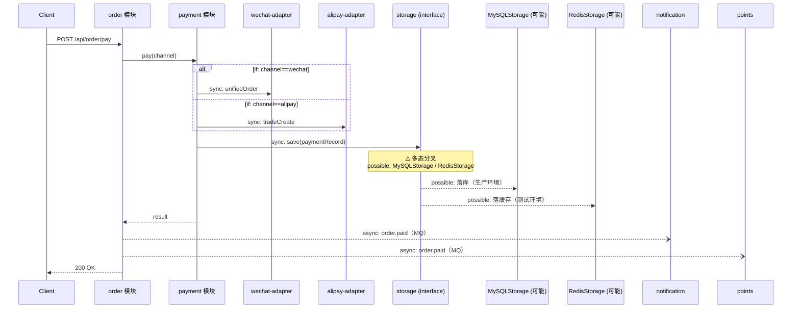

<!-- CHAIN: forward-api-order-pay -->
<!-- CHAIN_TYPE: forward -->
<!-- ENTRY_POINT: POST /api/order/pay -->
<!-- DEPTH: 4 -->
<!-- STATUS: VERIFIED -->
<!-- LAST_DERIVED: 2026-07-01 -->
<!-- LAST_VERIFIED: 2026-07-01 -->
<!-- SOURCE_MODULES_SNAPSHOT: order@2026-06-28, payment@2026-06-28, wechat-adapter@2026-06-25, alipay-adapter@2026-06-25, storage@2026-06-27, notification@2026-06-20, points@2026-06-20 -->
<!-- ANALYZER_VERSION: 1.6 -->

# 下单支付主链（正向）

从客户端发起 `POST /api/order/pay` 出发，经支付渠道分派、多态存储、异步扇出通知，直到 MQ 发布/落库结束。含 5 类分叉的完整表达，作为链路档案填法样例。

> 📌 **本文件是样例**（`_` 开头不参与 15 反查扫描），实际项目请复制 [`../templates/chain-template.md`](../templates/chain-template.md) 生成。

---

## 元信息

| 项 | 值 |
|----|----|
| 类型 | `forward` |
| 起点/入口 | `POST /api/order/pay` |
| 终点 | `MQ:topic:order.paid` 发布 + `MySQL/Redis` 落库 |
| 深度 | `4 跳` |
| 沿途模块 | `order → payment → {wechat-adapter | alipay-adapter} → storage → notification/points`（共 7 个，全部 🟢） |
| 分叉统计 | 条件 1 处 / 同步扇出 1 处 / 异步扇出 1 处 / 多态 1 处 / 成环 0 处 |
| 生成方式 | Agent 推导（16 Step 1-5，人工核对通过） |
| 关键词 | `order,pay,payment,checkout,下单,支付` |

---

## 时序图（Mermaid）

---

## 沿途外部资源

| 模块 | 数据库表 | Redis Key | MQ Topic | 外部 HTTP |
|------|---------|-----------|----------|----------|
| order | `t_order`（读写） | `order:lock:{orderId}` | `topic:order.paid`（发布） | - |
| payment | `t_payment`（读写） | - | - | - |
| wechat-adapter | - | - | - | `POST https://api.mch.weixin.qq.com/pay/unifiedorder` |
| alipay-adapter | - | - | - | `POST https://openapi.alipay.com/gateway.do` |
| storage | `t_payment`（生产写） | `payment:cache:{id}`（测试写） | - | - |
| notification | - | - | `topic:order.paid`（订阅） | - |
| points | `t_user_points`（写） | - | `topic:order.paid`（订阅） | - |

---

## 分叉分析

| 位置 | 分叉类型 | 关键条件 / 实现清单 | 影响 |
|------|---------|--------------------|------|
| `Payment.pay` | conditional | `channel ∈ {wechat, alipay}` | 运行时二选一，两条分支都需回归测试；新增渠道需同时新增 adapter 模块并更新档案 |
| `Payment → Storage.save` + `Order → 消息发布` | mix | 内含多态 + 异步扇出 | 见下 |
| `Storage.save` | polymorphic | `MySQLStorage` / `RedisStorage`（DI 登记，运行时按环境注入） | 生产走 MySQL，测试走 Redis；改 interface 需两套实现同步 |
| `Order → topic:order.paid` | async fan-out | 订阅方：`notification`、`points` | 失败降级不影响主链，但需监控订阅方消费成功率；新增订阅方需刷新 `_topics.md` 与本档案 |

> 无同步扇出与成环的实际案例（本样例聚焦其他 4 类分叉）；同步扇出在真实项目中形如 `Order.confirm` 同步调用 `Inventory.reduce` + `ES.index`，任一失败则主链失败。

---

## 断点与风险

- ⚠️ **多态分叉**（Storage.save）：静态无法确定运行时走 MySQL 还是 Redis，需查配置 `storage.driver` 环境变量
- ⚠️ **异步扇出**（`topic:order.paid`）：订阅方 `notification`/`points` 若失败仅告警，不阻塞主链；但需保证订阅方幂等（重放不重复扣分/重复通知）
- ✅ 无反射 / DI 静态断点 / 事件总线 / 成环
- ✅ 沿途 7 个模块全部 🟢 有效，链路可信

---

## 变更历史（Change Log）

| 日期 | 事件 | 说明 |
|------|------|------|
| 2026-07-01 | 首次推导 | 深度 4，沿途 7 模块全部 🟢，Agent 自动推导 |
| 2026-07-01 | 用户核对通过 | STATUS: DERIVED → VERIFIED；确认多态分叉的两个实现符合预期 |

<!-- 后续如果 order 模块档案更新，15 Step 5.5 会自动追加：
     | 2026-08-15 | 联动置为 STALE | order 模块 LAST_ANALYZED 由 2026-06-28 更新为 2026-08-15 |
     用户执行 `刷新调用链档案 forward-api-order-pay` 后追加：
     | 2026-08-15 | 用户触发重推 | STATUS: STALE → DERIVED，SOURCE_MODULES_SNAPSHOT 已更新
-->
