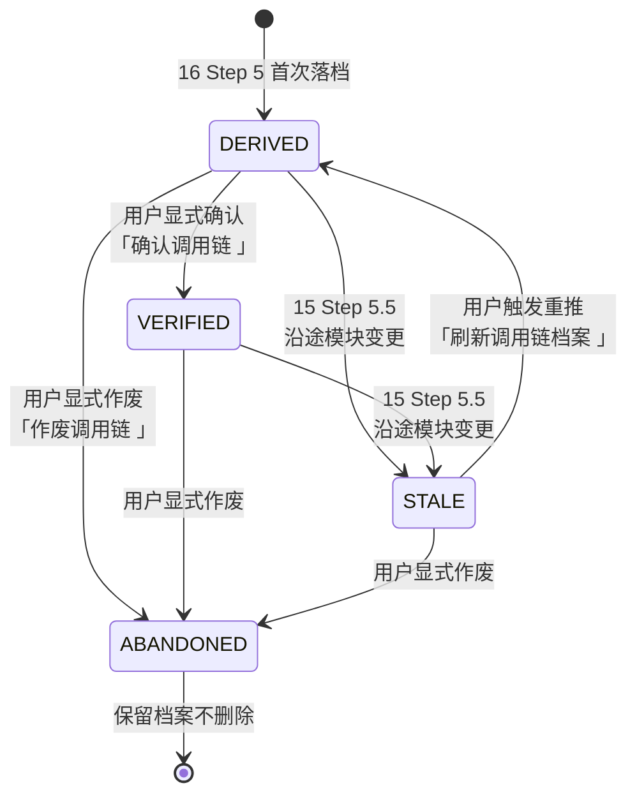

# 业务调用链档案目录

> 本目录用于**长期沉淀** 16 号工作流（[`16-call-chain-derivation.md`](../workflows/16-call-chain-derivation.md)）推导出的业务调用链，作为 Agent 跨会话的共享记忆。
>
> 与 `modules/` 目录的分工：
> - `modules/`：单模块的**静态档案**（是什么 / 提供什么 / 依赖什么），是**原料**
> - `chains/`：跨模块的**链路组合**（谁触发谁 / 走到哪里 / 落到哪里），是**产物**

## 目录文件说明

| 文件 | 类型 | 说明 |
|------|:----:|------|
| [`index.md`](./index.md) | ⭐ 核心必读 | 链路总索引，Agent 命中匹配的入口，每次推导后必须同步更新 |
| [`_example.md`](./_example.md) | 参考样例 | 链路档案完整样例，`_` 开头不被扫描 |
| `<chain-slug>.md` | 链路档案 | 具体链路推导产物，由 16 Step 5 落档生成，按需加载 |

> 📖 **想看完整样例？** 参考 [`_example.md`](./_example.md)（订单支付主链示例，覆盖 5 类分叉的完整表达）。

---

## 文件命名规范

```
<chain-type>-<entry-slug>.md
```

命名要素：

- `<chain-type>` ∈ `forward` / `reverse` / `data-lookup`（对应 16 号 Step 2.1 / 2.2 / 2.3 三种推导方向）
- `<entry-slug>` — 入口标识的 kebab-case 化：
  - HTTP 入口：`api-order-pay`（去掉动词与斜杠 → `POST /api/order/pay` → `api-order-pay`）
  - 函数入口：`user-svc-login`（`UserSvc.Login` → `user-svc-login`）
  - topic 入口：`topic-order-created`
  - 表反查入口：`table-t-order`

**示例**：

- `forward-api-order-pay.md` — 从 `POST /api/order/pay` 正向推导到落库
- `reverse-user-svc-login.md` — 从 `UserSvc.Login` 反向推导影响面
- `data-lookup-table-t-user.md` — 反查谁写入了 `t_user` 表

---

## 链路档案生命周期

每份链路档案头部维护 `STATUS` 字段，四种状态的流转关系如下：



| 状态 | 图标 | 含义 | 何时进入 | Agent 处置 |
|------|:---:|------|----------|-----------|
| `DERIVED` | 🟡 | 首次推导完成，等待核对 | 16 Step 5 首次落档 / STALE 后重推 | 加载复用，但要向用户明确"未核对，请人工 review" |
| `VERIFIED` | 🟢 | 用户已核对确认 | 用户回复"确认" / 触发 `确认调用链 <slug>` | 直接放心加载复用 |
| `STALE` | 🔴 | 沿途模块档案已更新，链路可能失真 | 15 Step 5.5 联动触发 | 加载时提示"⚠️ 已过期（因 X 模块 Y 时间更新）"，让用户决定是否 `刷新调用链档案 <slug>` |
| `ABANDONED` | ⚫ | 业务下线 / 入口废弃 / 用户作废 | 用户触发 `作废调用链 <slug>` | 不加载，仅保留档案供审计追溯 |

---

## 档案模板

每份链路档案建议包含以下段落（详见 [`_example.md`](./_example.md) 与 [`../templates/chain-template.md`](../templates/chain-template.md)）：

```markdown
<!-- CHAIN: <slug> -->
<!-- CHAIN_TYPE: forward | reverse | data-lookup -->
<!-- ENTRY_POINT: <入口标识> -->
<!-- DEPTH: 5 -->
<!-- STATUS: DERIVED | VERIFIED | STALE | ABANDONED -->
<!-- LAST_DERIVED: YYYY-MM-DD -->
<!-- LAST_VERIFIED: - | YYYY-MM-DD -->
<!-- SOURCE_MODULES_SNAPSHOT: order@2026-06-30, payment@2026-06-30, ... -->
<!-- ANALYZER_VERSION: 1.5 -->

# <链路名称>

## 元信息
（起点、终点、深度、类型、生成时间、生成方式）

## 时序图（Mermaid）
（含分叉标注、成环剪枝、断点风险）

## 沿途外部资源
（数据库表 / Redis Key / MQ Topic / 外部 HTTP，按模块聚合）

## 分叉分析
（条件 / 同步扇出 / 异步扇出 / 多态 / 事件总线，各处的语义与影响）

## 断点与风险
（反射 / DI / 事件总线 / 未建档 / 数据过期）

## 变更历史（Change Log）
| 日期 | 事件 | 说明 |
|------|------|------|
| 2026-07-01 | 首次推导 | 深度 5，沿途 6 模块全部 🟢 |
```

---

## 与 15 模块台账的联动契约

- 链路档案的 `SOURCE_MODULES_SNAPSHOT` 字段记录**推导时**沿途各模块的 `LAST_ANALYZED` 值
- **v1.9 快照格式**：`<group>/<module-name>@<YYYY-MM-DD>`（Group 内子模块）或 `<module-name>@<YYYY-MM-DD>`（顶层单模块），格式与 `modules/` 目录物理路径一致，Agent 可直接定位档案
- 15 Step 5.5 更新任一模块档案后，扫 `chains/index.md`，把所有涉及该模块的链路 `STATUS` 置为 `STALE`（并在链路档案「变更历史」追加一行）
- 16 Step 0 加载已推导链路前会做时效判定：对比 `SOURCE_MODULES_SNAPSHOT` 与当前各模块的 `LAST_ANALYZED`，任一不一致 → 视为 `STALE`

> 该联动是**只降级不重推**：15 只负责置为 `STALE`，不触发重推（避免为一次改动触发大量 tokens）。重推由用户显式触发。

---

## 双向反向索引（v1.9 新增）

链路档案 ↔ 模块档案是**双向可导航**的：

| 方向 | 字段 | 维护方 | 消费方 |
|-----|------|-------|-------|
| 链路 → 模块（正向） | 链路档案 `SOURCE_MODULES_SNAPSHOT` | 16 Step 6.3 落档时写入 | 时效判定 / 用户从链路查模块细节 |
| 模块 → 链路（反向） | 模块档案 `INVOLVED_CHAINS` | 16 Step 6.7 落档时反向注入 | Agent 加载模块时看到它参与了哪些链路 |
| Group → 链路（Group 级聚合） | `<group>/group.md`「涉及的调用链档案」表 | 16 Step 6.7 同步更新 | Group 级影响面速查 |

**Agent 使用姿势**：

- **场景 A**：从链路出发看每一跳的模块细节 → 读 `chains/<slug>.md` 的 `SOURCE_MODULES_SNAPSHOT`
- **场景 B**：从模块出发看它参与了哪些业务链 → 读 `modules/<group>/<module>.md` 头部 `INVOLVED_CHAINS`
- **场景 C**：改一个模块前评估影响面 → 读 `INVOLVED_CHAINS` → 每条链的下游 → 精准告警影响面

---

> 💡 详细推导流程见 [`16-call-chain-derivation.md`](../workflows/16-call-chain-derivation.md)；索引维护规则见 [`index.md`](./index.md)。
