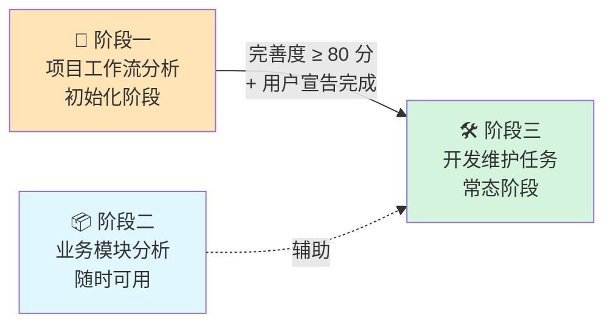

# 🔄 工作流生命周期

> 本文件是工作流生命周期机制的**权威说明**，包含三阶段定义、阶段一完善度评分规则与解锁条件。
> 入口索引：[AGENTS.md](../AGENTS.md) | 分析器指令：[analyzer-instructions.md](./analyzer-instructions.md)

---

## 三阶段模型

本工作流分为三个阶段，**阶段三依赖阶段一完成后才能解锁**：



| 阶段 | 名称 | 前置条件 | 性质 |
|:----:|------|---------|------|
| **一** | 📐 项目工作流分析 | 无 | 一次性初始化，完成后解锁阶段三 |
| **二** | 📦 业务模块分析 | 无（独立进行） | 随时可用，不阻塞也不被阻塞 |
| **三** | 🛠️ 开发维护任务 | **阶段一必须完成** | 日常常态工作 |

---

## 阶段状态标记

当前阶段状态存储在 `AGENTS.md` 顶部的 `LIFECYCLE_PHASE` 元数据中：

| 值 | 含义 |
|----|------|
| `PHASE_1_INITIALIZING` | 阶段一进行中，阶段三未解锁 |
| `PHASE_1_COMPLETED` | 阶段一已完成，阶段三已解锁 |
| `PHASE_3_OPERATIONAL` | 已进入常态运营阶段 |

---

## 阶段一完善度评分标准

> Agent 在每次分析完成后自动计算并更新 `AGENTS.md` 的「🔰 当前阶段状态」面板。
> 用户也可随时输入 `查看工作流完善度` 触发重新计算。

### 评分规则

| 类别 | 模块 | 单项分值 | 满分 | 说明 |
|:----:|------|:-------:|:---:|------|
| **核心模块**（必须全部 🟢） | 01 项目说明 | 20 分 | 20 | 项目基本信息、技术栈、团队 |
| | 02 规则限制 | 20 分 | 20 | 代码规范、Lint 规则 |
| | 03 开发流程 | 20 分 | 20 | 本地开发环境、启动命令 |
| | 11 分支提交 | 20 分 | 20 | 分支命名、Commit 规范 |
| **扩展模块**（加分项） | 04 编译流程 | 4 分 | 4 | 构建命令、产物路径 |
| | 05 测试流程 | 4 分 | 4 | 测试框架、运行命令 |
| | 07 Bug排查修复 | 4 分 | 4 | 日志、调试、错误追踪 |
| | 08 代码Review | 4 分 | 4 | CODEOWNERS、PR 模板 |
| | 12 PR提交 | 4 分 | 4 | PR 流程、审批规则 |
| **合计** | | | **100 分** | |

### 得分计算方式

- 模块状态 🟢 DONE → 获得该模块**全部分值**
- 模块状态 🟡 PARTIAL → 获得该模块**一半分值**
- 模块状态 🔴 TODO → **0 分**

### 解锁条件（两者同时满足）

1. **客观条件**：总分 ≥ 80 分（即 4 个核心模块全部 🟢）
2. **主观条件**：用户显式输入 `完成项目工作流分析` 宣告完成

> 满足解锁条件后，Agent 将 `AGENTS.md` 顶部的 `LIFECYCLE_PHASE` 更新为 `PHASE_1_COMPLETED`，
> 同时更新「🔰 当前阶段状态」面板，阶段三功能正式解锁。

### 评分示例

```
📊 工作流完善度评分

核心模块（80 分）：
  ✅ 01 项目说明     🟢 DONE    → 20/20
  ✅ 02 规则限制     🟢 DONE    → 20/20
  ⚠️ 03 开发流程     🟡 PARTIAL → 10/20
  ❌ 11 分支提交     🔴 TODO    →  0/20

扩展模块（20 分）：
  ✅ 04 编译流程     🟢 DONE    →  4/4
  ❌ 05 测试流程     🔴 TODO    →  0/4
  ❌ 07 Bug排查修复  🔴 TODO    →  0/4
  ❌ 08 代码Review   🔴 TODO    →  0/4
  ❌ 12 PR提交       🔴 TODO    →  0/4

当前总分：54/100 分
阶段一状态：🔴 未完成（需 ≥ 80 分且核心模块全绿）

💡 建议：先完善「11 分支提交」和「03 开发流程」，可获得 +30 分。
```

---

## 完善缺口交互指令

| 指令 | 说明 |
|------|------|
| `查看工作流完善度` | 重新计算并输出完善度评分报告 |
| `完善 <模块名>` | 针对指定模块发起专项追问，收集信息后更新对应 workflow 文件 |
| `完成项目工作流分析` | 宣告阶段一完成，触发解锁检查 |
