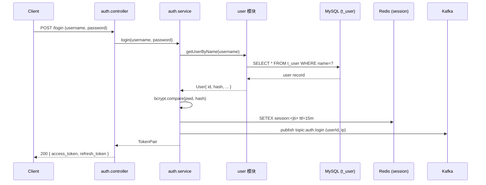

<!-- MODULE: example-user-auth -->
<!-- STATUS: DONE -->
<!-- LAST_ANALYZED: 2026-07-01 -->
<!-- ANALYZER_VERSION: 1.0 -->
<!-- SIZE: 1240 lines / 8 files / 12 exported symbols -->

# 用户认证模块（示例）

> 本文件为业务模块文档**完整示例**，展示按 [15-module-inventory.md](../workflows/15-module-inventory.md) 规范完成分析后的最终形态。
>
> 文件名以 `_` 开头，会被分析器忽略，不会被覆盖。真实模块档案命名参见 [modules-guide.md](./modules-guide.md)。

---

## 功能概述

<!-- CONTENT_START: overview -->
负责系统的用户身份认证与会话管理，提供以下能力：

- 账号密码登录、登出
- OAuth2 第三方登录（GitHub / Google）
- JWT Token 签发与刷新
- 会话黑名单与强制登出
- 双因素认证（2FA）

**粒度自检**（按 15 版 Step 1.1）：
- ✅ 职责单一：一句话概括——"负责用户身份认证与会话生命周期管理"
- ✅ 入口收敛：所有对外接口聚合在 `src/auth/controller.ts` + `src/auth/service.ts`
- ✅ 内聚闭合：修改 2FA 逻辑不影响 `user`、`order` 等模块的内部实现
- ✅ 数据自洽：拥有独立的 `TokenPair`、`UserClaims` 数据结构，只读 `user` 的公开字段
<!-- CONTENT_END: overview -->

---

## 入口点（Entry Points）

<!-- CONTENT_START: entry_points -->
> 供业务调用链推导（15 版 Step 8）作为链路起点使用。

| 类型 | 入口标识 | 触发函数 | 说明 |
|------|---------|---------|------|
| HTTP | `POST /api/v1/auth/login` | `login()` | 账号密码登录 |
| HTTP | `POST /api/v1/auth/logout` | `logout()` | 登出当前会话 |
| HTTP | `POST /api/v1/auth/refresh` | `refresh()` | 刷新 access_token |
| HTTP | `GET  /api/v1/auth/me` | `getMe()` | 获取当前登录用户信息 |
| HTTP | `POST /api/v1/auth/2fa/verify` | `verify2FA()` | 校验 2FA 验证码 |
| HTTP | `GET  /api/v1/auth/oauth/callback` | `oauthCallback()` | OAuth2 回调 |
| 内部函数 | `verifyAccessToken(token)` | 同名 | 供 gateway/其他模块直接调用的 Token 校验入口 |
<!-- CONTENT_END: entry_points -->

---

## 数据流向

<!-- CONTENT_START: data_flow -->

<!-- CONTENT_END: data_flow -->

---

## 核心接口

<!-- CONTENT_START: core_interfaces -->
```ts
// src/auth/service.ts —— 对外导出符号（供本仓库其他模块引用）
export async function login(username: string, password: string): Promise<TokenPair>
export async function logout(jti: string): Promise<void>
export async function refresh(refreshToken: string): Promise<TokenPair>
export async function verifyAccessToken(token: string): Promise<UserClaims>
export async function verify2FA(userId: string, code: string): Promise<TokenPair>
```

| 接口 | 稳定性 | 变更需级联刷新的下游 |
|------|:-----:|--------------------|
| `verifyAccessToken` | 🔒 稳定 | 全部下游调用方（改签名影响面极大） |
| `login` / `refresh` | 🔒 稳定 | `api-gateway`、`admin-panel` |
| `verify2FA` | 🟡 演进中 | `admin-panel` |
<!-- CONTENT_END: core_interfaces -->

---

## 上游依赖（我依赖谁）

<!-- CONTENT_START: upstream_dependencies -->
> 仅列本仓库内的其他模块，第三方库放在「注意事项」或此段末尾单独标注。

- **`user` 模块**：调用 `getUserByName(name)`、`getUserById(id)` 读取用户基本信息与密码哈希
- **`redis-client` 模块**：使用 `set/get/del` 做会话存储与 Token 黑名单
- **`config` 模块**：读取 JWT 密钥、Token TTL、OAuth 客户端配置
- **`logger` 模块**：结构化日志输出

**第三方库（非模块级依赖，仅备注）**：`bcrypt`、`jsonwebtoken`、`passport-oauth2`
<!-- CONTENT_END: upstream_dependencies -->

---

## 下游调用方（谁依赖我） · 1 层直接调用

<!-- CONTENT_START: downstream_callers -->
> 通过反向搜索本模块导出符号得出，仅记录 1 层直接调用方。

- **`api-gateway`**：所有受保护路由中间件调用 `verifyAccessToken(token)`（约 47 处）
- **`admin-panel`**：调用 `getMe()`、`verify2FA()` 用于管理端登录（12 处）
- **`notification`**：调用 `verifyAccessToken(token)` 校验 WebSocket 连接身份（3 处）
- **`order`**：调用 `verifyAccessToken(token)` 用于下单时二次校验（2 处）

（另有测试代码 8 处调用未逐一列出）
<!-- CONTENT_END: downstream_callers -->

---

## 下游数据/接口调用（我调用的外部资源） · 1 层

<!-- CONTENT_START: downstream_data_calls -->
| 类别 | 资源 | 读写 | 用途 |
|------|------|:----:|------|
| **数据库表** | `t_user` | 读 | 通过 `user` 模块读取用户密码哈希、状态位 |
| **数据库表** | `t_login_log` | 写 | 记录登录成功/失败流水 |
| **Redis Key** | `session:<jti>` | 读写 | 会话存储，TTL = access_token 有效期 |
| **Redis Key** | `blacklist:<jti>` | 读写 | Token 黑名单（登出后写入） |
| **Redis Key** | `2fa:code:<userId>` | 读写 | 2FA 验证码缓存（TTL 5 分钟） |
| **消息队列** | `topic:auth.login` | 发布 | 登录成功事件（notification/audit 订阅） |
| **消息队列** | `topic:auth.logout` | 发布 | 登出事件（notification 订阅） |
| **外部 HTTP** | `POST https://github.com/login/oauth/access_token` | 调用 | GitHub OAuth 换 token |
| **外部 HTTP** | `POST https://oauth2.googleapis.com/token` | 调用 | Google OAuth 换 token |
<!-- CONTENT_END: downstream_data_calls -->

---

## 关键数据结构

<!-- CONTENT_START: data_structures -->
```ts
// 对外暴露的数据结构（跨模块共享，变更需级联评估）
export interface TokenPair {
  access_token: string;   // 短期，默认 15 分钟
  refresh_token: string;  // 长期，默认 7 天，支持滚动续期
  token_type: 'Bearer';
  expires_in: number;
}

export interface UserClaims {
  sub: string;            // 用户 ID
  username: string;
  roles: string[];
  jti: string;            // JWT ID，用于黑名单查询
  iat: number;
  exp: number;
}

// 内部数据结构（不对外暴露，可自由重构）
interface LoginContext {
  ip: string;
  userAgent: string;
  loginType: 'password' | 'oauth-github' | 'oauth-google';
}
```
<!-- CONTENT_END: data_structures -->

---

## 注意事项

<!-- CONTENT_START: caution -->
- **密码哈希**：必须使用 `bcrypt`（cost ≥ 12），禁止使用 MD5 / SHA1
- **Token 校验**：所有对外 API 必须经 `verifyAccessToken` 校验后再访问业务逻辑
- **黑名单一致性**：登出时务必把 `jti` 写入 Redis 黑名单，TTL 等于 token 剩余有效期
- **2FA 状态机**：开启 2FA 的用户 `login()` 只返回**临时 token**，必须再调 `verify2FA()` 才能拿到正式 access_token
- **敏感字段隔离**：禁止把 `password_hash` 透传到 `user` 模块以外的任何地方
- **动态调用告警**：`api-gateway` 通过反射注入本模块，静态扫描可能漏掉部分调用点
- **接口签名稳定性**：`verifyAccessToken` 是全系统受保护路由的唯一校验点，改签名前必须走「Step 5.3 级联刷新」
<!-- CONTENT_END: caution -->

---

## 相关文件

<!-- CONTENT_START: related_files -->
```
src/auth/controller.ts     — HTTP 入口层（对应「入口点」章节）
src/auth/service.ts        — 业务逻辑层，核心导出符号
src/auth/jwt.ts            — Token 签发与校验
src/auth/oauth.ts          — 第三方登录集成
src/auth/2fa.ts            — 双因素认证
src/auth/session.ts        — Redis 会话读写封装
src/auth/types.ts          — 对外数据结构定义（TokenPair / UserClaims）
tests/auth/*.spec.ts       — 单元测试（代表性 3 个）
```
<!-- CONTENT_END: related_files -->

---

## 备注

<!-- CONTENT_START: notes -->
- 本文件为**示例档案**，用于演示 15 版规范下模块档案的完整形态
- 粒度裁决记录：曾评估将 `oauth.ts` 独立为模块，因外部只通过 `login()` 统一入口调用（入口收敛原则），最终归入本模块
- 时效性说明：`LAST_ANALYZED = 2026-07-01`，若模块内文件在此日期后有 commit，Agent 加载前应触发时效性校验（15 版 Step 6）
<!-- CONTENT_END: notes -->

---

<!-- DETECTION_HINTS:
  探测规则（Agent 分析时使用）：
  - 扫描目录: src/auth/**
  - 入口识别: controller.ts 中的路由注册 + service.ts 的 export 符号
  - 反向调用扫描: grep 全仓库对 verifyAccessToken / login / refresh / verify2FA 的引用
  - 外部资源扫描: grep SQL(t_user, t_login_log) / redis(session:, blacklist:, 2fa:code:) / kafka(topic:auth.*)
  - 关键数据结构: TokenPair / UserClaims（跨模块共享，变更需级联）
-->
