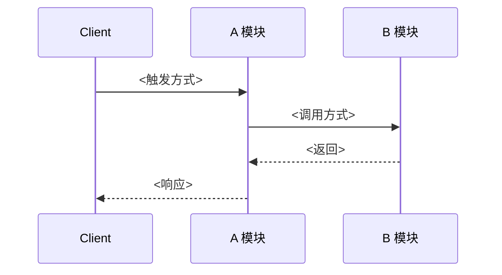

<!-- CHAIN: <slug>（同文件名，去掉 .md） -->
<!-- CHAIN_TYPE: forward | reverse | data-lookup -->
<!-- ENTRY_POINT: <入口标识：HTTP 路径 / 函数名 / topic / 表名> -->
<!-- DEPTH: 5 -->
<!-- STATUS: DERIVED -->
<!-- LAST_DERIVED: YYYY-MM-DD -->
<!-- LAST_VERIFIED: - -->
<!-- SOURCE_MODULES_SNAPSHOT: <group-a>/module-a@YYYY-MM-DD, module-b@YYYY-MM-DD, ... -->
<!-- ANALYZER_VERSION: 1.6 -->

# <链路名称>

<!-- 一句话概括本链路做什么，从哪儿出发到哪儿结束 -->

> **v1.9 快照格式**：`SOURCE_MODULES_SNAPSHOT` 中的模块引用按 `<group>/<module>@<date>` 或 `<module>@<date>`（顶层单模块）书写，与 `modules/` 目录物理路径一致，便于 Agent 直接定位档案。

---

## 元信息

| 项 | 值 |
|----|----|
| 类型 | `forward` / `reverse` / `data-lookup` |
| 起点/入口 | `<入口标识>` |
| 终点 | `<落点：数据库表 / 外部服务 / 返回客户端 / MQ 发布>` |
| 深度 | `N 跳` |
| 沿途模块 | `moduleA → moduleB → moduleC → ...`（共 N 个，X 🟢 / Y 🟡 / Z 🔴 / W ⚪） |
| 分叉统计 | 条件 X 处 / 同步扇出 Y 处 / 异步扇出 Z 处 / 多态 M 处 / 成环 N 处 |
| 生成方式 | Agent 推导（16 Step 1-5）/ 人工补录 |
| 关键词 | `<用于 index.md 匹配的关键词，英文逗号分隔，≤8 个>` |

---

## 时序图（Mermaid）

<!-- 遵循 16 Step 2.5 分叉表达约定：
     - 条件分叉必用 alt/else 并标注条件
     - 同步扇出用实线箭头 + `sync:` 前缀
     - 异步扇出用虚线箭头 + `async:` 前缀
     - 多态用 `possible:` 前缀 + Note over 标注
     - 成环画 cycle-back 边并 ⚠️ 标注 -->

---

## 沿途外部资源

| 模块 | 数据库表 | Redis Key | MQ Topic | 外部 HTTP |
|------|---------|-----------|----------|----------|
| A    | -       | -         | -        | -        |

---

## 分叉分析

| 位置 | 分叉类型 | 关键条件 / 实现清单 | 影响 |
|------|---------|--------------------|------|
| <模块.接口> | conditional / sync fan-out / async fan-out / polymorphic / event-bus | <条件表达式或实现列表> | <改动此处的联动风险> |

---

## 断点与风险

- ⚠️ / ⚪ / 🔴 <断点位置>：<原因说明>
- ...

---

## 变更历史（Change Log）

| 日期 | 事件 | 说明 |
|------|------|------|
| YYYY-MM-DD | 首次推导 | 深度 N，沿途全部 🟢 |

<!-- 沿途模块档案更新时，15 Step 5.5 会自动追加类似：
     | YYYY-MM-DD | 联动置为 STALE | order 模块 LAST_ANALYZED 由 X 更新为 Y |
-->
