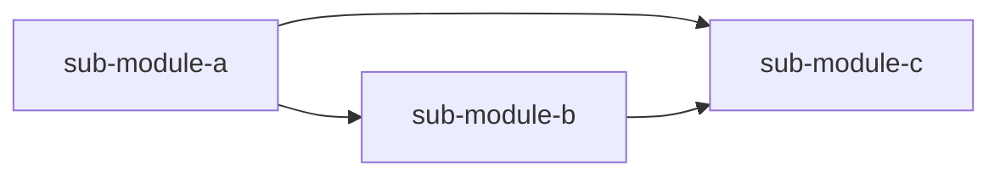

<!-- MODULE_GROUP: {group-id} -->
<!-- STATUS: TODO -->
<!-- LAST_ANALYZED: -->
<!-- SUB_MODULE_COUNT: 0 -->
<!-- ANALYZER_VERSION: 1.6 -->

# {大模块标题}

> {大模块（Group）一句话职责与定位}

---

## Group 概览

<!-- CONTENT_START: overview -->
> ⚠️ **待实现** - 本 Group 的一句话职责 + 边界说明。

- **职责**：（一句话）
- **边界**：本 Group 内部包含哪些子领域，不包含哪些
- **建组理由**：为何这些子模块聚合为同一 Group（例如 Monorepo 子包、分层内同一业务域、共享核心状态）
<!-- CONTENT_END: overview -->

---

## 内部结构关系图（Mermaid）

<!-- CONTENT_START: internal_structure -->
> ⚠️ **待实现** - 用 mermaid 描述**本 Group 内部**子模块之间的调用/依赖关系。跨 Group 依赖放到「Group 级上下游」章节。

<!-- CONTENT_END: internal_structure -->

---

## 子模块清单

<!-- CONTENT_START: sub_modules -->
> ⚠️ **待实现** - Agent 生成本 Group 时同步填写。**Agent 强制规则**：新增/删除本 Group 下的子模块档案后必须立即同步更新本表。

| 子模块 | 一句话职责 | 关键词 | 状态 | 时效 | 最后更新 | 文件 |
|--------|-----------|--------|:----:|:----:|:--------:|------|
| _尚未生成子模块_ | - | - | - | - | - | - |

**状态说明**：🔴 待分析 | 🟡 部分完成 | 🟢 已完成
**时效说明**：🟢 有效 | 🟡 待验证 | 🔴 已过期 | ⚪ 未建档
<!-- CONTENT_END: sub_modules -->

---

## Group 级对外接口

<!-- CONTENT_START: group_interfaces -->
> ⚠️ **待实现** - 聚合本 Group 所有子模块中"对 Group 外部暴露"的接口清单，帮助 Agent 快速评估 Group 级的能力面。

| 接口 | 提供子模块 | 稳定性 | 典型调用方 |
|------|-----------|:-----:|-----------|
| _尚未聚合_ | - | - | - |

**稳定性说明**：🔒 稳定 | 🟡 演进中 | ⚗️ 实验性
<!-- CONTENT_END: group_interfaces -->

---

## Group 级上下游（跨 Group 依赖）

<!-- CONTENT_START: group_dependencies -->
> ⚠️ **待实现** - 只记录**跨 Group** 的依赖关系；本 Group 内部子模块间的依赖不在此列出（内部依赖见「内部结构关系图」）。

**上游 Group**（本 Group 依赖谁）：
- `<group-x>`：使用其 xxx 能力
- `<group-y>`：使用其 xxx 数据

**下游 Group**（谁依赖本 Group）：
- `<group-a>`：调用本 Group 的 xxx 接口
- `<group-b>`：调用本 Group 的 xxx 接口

> 📌 顶层单模块（未归入任何 Group 的模块）也在此列出即可。
<!-- CONTENT_END: group_dependencies -->

---

## 涉及的调用链档案（反向索引）

<!-- CONTENT_START: involved_chains -->
> ⚠️ **待实现** - 由 16 号工作流 Step 6.7 反向索引维护自动填写；用户可以从这里跳转到具体链路档案。

| 链路 slug | 类型 | 起点 | 状态 | 时效 |
|----------|:---:|------|:---:|:---:|
| _尚无涉及本 Group 的链路档案_ | - | - | - | - |
<!-- CONTENT_END: involved_chains -->

---

## 备注

<!-- CONTENT_START: notes -->
- 本 Group 的粒度裁决记录（为什么归为同一 Group / 为什么拆成两个 Group 等）
- 命名约定（本 Group 内部子模块命名规范）
- 已知坑点（本 Group 特有的注意事项，跨子模块共同关注的问题）
<!-- CONTENT_END: notes -->

---

<!-- DETECTION_HINTS:
  以下是 Agent 生成本 Group 索引时的探测提示（不会在渲染中显示）：
  - 扫描目录: {待填写，例如 src/core/**}
  - 子模块识别: 目录下每个独立入口/职责域视为一个候选子模块
  - Group 级接口聚合: 收集所有子模块「核心接口」段中标注为「对 Group 外部」的条目
  - 跨 Group 依赖识别: 排除本 Group 内部依赖后，剩余的模块间依赖即为跨 Group 依赖
-->
