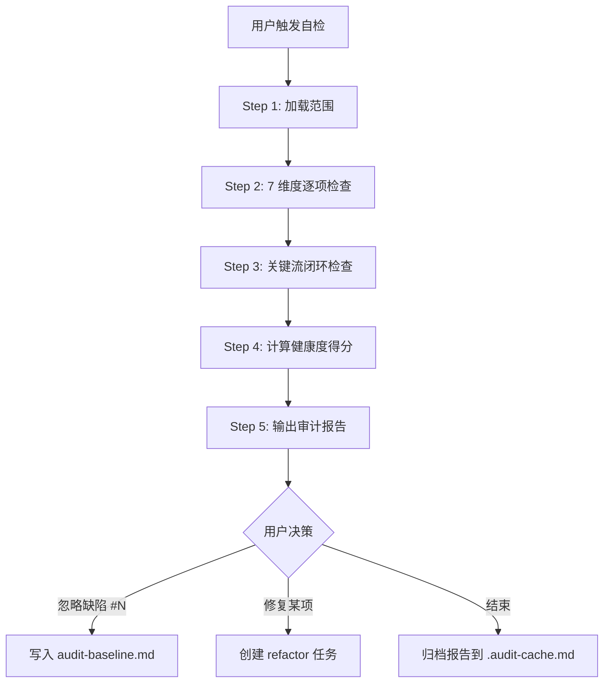
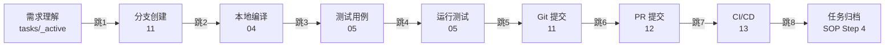

<!-- MODULE: workflow-self-check -->
<!-- WORKFLOW_TYPE: META -->
<!-- STATUS: DONE -->
<!-- LAST_ANALYZED: N/A -->
<!-- ANALYZER_VERSION: 1.6 -->
<!-- 注：META 流程不参与项目侦察，LAST_ANALYZED 固定为 N/A；STATUS=DONE 表示"模板自带能力"，非"项目侦察后已完成"。 -->

# 工作流自检（Workflow Self-Check）

> 对 `01-13` 流程文档与任务 SOP 做**质量审计**：检查完整性、歧义、闭环、一致性，输出**健康度报告 + 缺陷清单 + 修复建议**。
>
> 本流程是**元流程（META）**——它审计其他流程，本身**不参与阶段一完善度评分**，无需项目侧填充内容。模板复用到新项目后即开箱可用。

---

## 概述

<!-- CONTENT_START: overview -->
**定位**：

- ✅ 它是什么：**SOP 的 Code Review**，把 13 份流程文档当作代码做静态审计
- ❌ 它不是什么：不是项目侦察（那是 `analyzer-instructions.md` 的职责），不是再写一遍 SOP

**与现有机制的边界**：

| 机制 | 关注点 | 输入 | 产出 |
|------|-------|------|------|
| 阶段一完善度（[lifecycle.md](../lifecycle.md)） | **有没有写**（STATUS） | 文件元数据 | 0/100 完善度分 |
| **工作流自检（本流程）** | **写得好不好**（正文质量） | 文件正文 + 跨文件引用 | 0/100 健康度分 + 缺陷清单 |

**适用场景**：

- 阶段一完成后，定期巡检 SOP 是否仍闭环、是否有歧义
- 接手他人维护的 `.agent-workflow/` 后，先体检再上手
- 修订过某个流程文档后，确认对其他流程的引用是否同步
<!-- CONTENT_END: overview -->

---

## 触发指令

<!-- CONTENT_START: triggers -->

| 指令 | 说明 |
|------|------|
| `启动工作流自检` / `自检工作流` / `Workflow self-check` | 全量自检（13 个流程 + 任务 SOP + 关键流闭环） |
| `自检 <模块名>` | 单流程自检（例：`自检 编译流程`、`自检 分支提交`） |
| `自检 关键流` | 仅检查"需求 → 分支 → 编译 → 测试 → 用例 → 提交 → PR → CI → 归档"闭环 |
| `查看自检报告` | 输出最近一次自检结果（若存在 `.agent-workflow/.audit-cache.md`） |
| `忽略缺陷 #N` | 把第 N 条缺陷标记为"已知豁免"，写入 `.agent-workflow/audit-baseline.md` 不再重复报告 |

> 💡 本期**不**实现 `--fix` 自动修复，避免误改文档。Agent 在报告末尾给出修复建议，由人或后续 task 完成实际修订。
<!-- CONTENT_END: triggers -->

---

## 流程 SOP

<!-- CONTENT_START: workflow_sop -->



### Step 1 · 加载审计范围

读取 `AGENTS.md` 的「📊 工作流程状态总览」表，根据用户指令确定范围：

- **全量自检**：13 个 workflow 文件 + `AGENTS.md` 任务 SOP 章节 + `tasks-guide.md`
- **单模块自检**：仅指定的 1 个 workflow 文件
- **关键流自检**：03 / 04 / 05 / 11 / 12 / 13 + 任务 SOP

> ⚠️ 跳过 STATUS = TODO 的模块（未填内容无法审计），但在报告中列为 `⏭ 跳过（待实现）`。

> 📦 **模板工程模式**（特殊语境）：若检测到 01-13 全部 STATUS=TODO（典型场景：当前仓库即模板源仓库 / 刚 clone 模板尚未跑过阶段一），自检的"项目侦察类流程"维度将无对象可审计。此时 Agent 应：
>
> 1. **明确告知用户**："当前仓库 01-13 流程文档为空骨架，业务侦察类检查（D1/D3/D6 等）无对象可审；本次自检将聚焦在**模板自身的元素质量**——任务 SOP / 任务模板 / 各 `*-guide.md` / META 流程内部一致性 / 跨文件引用闭环（D4 / D5，含 D5.E1~E6 机械规则）。"
> 2. **建议替代动作**：要么先输入 `分析项目工作流` 完成阶段一再自检，要么仅做 `自检 关键流` 检查 SOP 闭环。
> 3. **若用户坚持全量自检**：按"模板治理"视角推进——重点产出 D4 / D5 维度的缺陷清单，D1/D3/D6 等业务侦察相关维度在报告中标注 `N/A（模板工程，无项目内容）`，避免给用户"健康度大幅扣分"的错误感知。

### Step 2 · 7 维度逐项检查

对每个在审范围的文件执行下列检查（详细规则见下方「检查维度」章节）：

| 维度 | 一句话描述 |
|:----:|----------|
| D1 完整性 | 占位符是否全部替换、必填章节是否齐全 |
| D2 歧义性 | 是否存在含糊词、命令是否给出确切字符串 |
| D3 可执行性 | 命令是否可直接 copy-paste 运行 |
| D4 闭环性 | 关键流的每一跳是否有显式衔接 |
| D5 一致性 | 跨文件引用是否互相矛盾 |
| D6 可验证性 | 是否有验收/通过条件 |
| D7 可恢复性 | 是否有回滚/阻塞解除路径 |

### Step 3 · 关键流闭环检查

按下图 8 跳逐一验证文档间是否有显式衔接（找不到衔接 = 闭环缺口）：



> 💡 "显式衔接"判定标准：上游文档末尾必须有指向下游文档的链接（如 `[查看 12-pull-request.md](...)`），或下游文档开头明确引用上游的产出物。

### Step 4 · 计算健康度得分

```
健康度 = max(0, 100 - Σ缺陷扣分)

缺陷等级与扣分：
  🔴 严重（Critical）：闭环断裂、命令无法执行、关键流缺失      → -10/项
  🟠 重要（Major）：跨文件矛盾、缺验收标准、含糊命令               →  -5/项
  🟡 提示（Minor）：表述歧义、引用过时、缺示例                     →  -2/项
  ⚪ 风格（Style）：格式不一致、emoji 缺失、表格对齐                →-0.5/项
```

**健康度阈值**：

| 区间 | 等级 | 含义 |
|------|:---:|------|
| ≥ 90 | 🟢 健康（Healthy） | 可放心进入常态阶段 |
| 70 ~ 89 | 🟡 亚健康（Warning） | 建议尽快治理，影响不严重 |
| < 70 | 🔴 病态（Critical） | 强烈建议先治理再继续开发 |

> 💡 已写入 `audit-baseline.md` 的豁免缺陷不计入扣分，但在报告中以 `🤍 已豁免` 标识。

### Step 5 · 输出审计报告

报告格式见下方「输出报告格式」章节。报告同步写入 `.agent-workflow/.audit-cache.md` 供 `查看自检报告` 复用。
<!-- CONTENT_END: workflow_sop -->

---

## 检查维度详解

<!-- CONTENT_START: dimensions -->

### D1 · 完整性（Completeness）

| 规则 | 严重度 | 检查方式 |
|------|:------:|---------|
| 不应残留 `<!-- CONTENT_START: -->` 块内的 `⚠️ 待实现` 占位符 | 🔴 严重 | 文本搜索 `⚠️ 待实现` 且 STATUS=DONE |
| 不应残留模板占位 `{xxx}`、`TODO:`、`FIXME:` | 🟠 重要 | 正则 `\{[a-z_]+\}` / `TODO:` / `FIXME:` |
| 必填章节齐全（流程 SOP / 配置 / 相关文件） | 🟠 重要 | 章节标题 grep |
| 相关文件章节不应为空（除非真无相关文件） | 🟡 提示 | 节点内容长度 |

### D2 · 歧义性（Clarity）

| 规则 | 严重度 | 检查方式 |
|------|:------:|---------|
| SOP 步骤中不应出现含糊词：`通常`、`一般`、`大概`、`若干`、`等等`、`可能` | 🟡 提示 | 关键词扫描 |
| 命令应给出**确切**字符串，避免"运行编译命令"、"执行测试" | 🟠 重要 | 正则匹配占位描述 |
| 分支命名应给出正则或 ≥2 个具体示例 | 🟠 重要 | 11 文件章节内容 |
| 时间/版本/阈值应给出具体数值，避免"较新版本"、"足够覆盖率" | 🟡 提示 | 关键词扫描 |

### D3 · 可执行性（Executability）

| 规则 | 严重度 | 检查方式 |
|------|:------:|---------|
| 编译/测试/启动命令必须包含完整 shell 调用（含工作目录或前置 `cd`） | 🔴 严重 | 代码块内容检查 |
| 依赖的环境变量必须在同文件或被引用文件中说明 | 🟠 重要 | 变量出现 vs 定义 |
| 产物路径必须明确（绝对或相对项目根） | 🟠 重要 | 04 / 06 章节检查 |
| 命令示例应可直接 copy-paste，不应混入伪代码 | 🟠 重要 | 代码块语法 |

### D4 · 闭环性（Closure）

| 规则 | 严重度 | 检查方式 |
|------|:------:|---------|
| 关键流 8 跳每跳必须有显式衔接 | 🔴 严重 | 跨文件链接检查 |
| 任务 SOP 的 BLOCKED → IN_PROGRESS 路径必须完整（参考 [AGENTS.md](../../AGENTS.md) 的 Step 2.5） | 🔴 严重 | SOP 章节扫描 |
| 任务完成后必须有归档动作 | 🔴 严重 | SOP Step 4 扫描 |
| 每个 workflow 应在末尾或"相关文件"列出下一步可跳转的流程 | 🟠 重要 | 末尾段落检查 |

### D5 · 一致性（Consistency）

| 规则 | 严重度 | 检查方式 |
|------|:------:|---------|
| 同一命令在多文件中描述应一致（如 `npm run build` vs `make build`） | 🟠 重要 | 跨文件命令对比 |
| 分支命名规范只能在 11 定义，03/07 仅引用不重复定义 | 🟠 重要 | 跨文件章节对比 |
| Commit 格式只能在 11 定义 | 🟠 重要 | 同上 |
| 元数据字段命名一致（`TASK_TYPE` / `CREATED` 等） | 🟡 提示 | 模板 vs SOP 字段名 |
| **D5.E1** `RELATED_WORKFLOWS:` 元数据值必须**完整等于** `analyzer-instructions.md#约束常量表` 表 A 对应常量（feature/bugfix/refactor 各自） | 🟠 重要 | 元数据值 vs 表 A 行 |
| **D5.E2** 任务相关文件出现 `STATUS=...` 时，值必须属于表 A `TASK_STATUS_ENUM`；`TASK_TYPE=...` 必须属于 `TASK_TYPE_ENUM` | 🟠 重要 | 元数据 grep + 集合包含 |
| **D5.E3** 「风险与阻塞」表「状态」列单元格只能是 `跟进中` / `已解除` / `-`（占位）三选一（即表 A `RISK_STATUS_ENUM`） | 🟡 提示 | 表格列正则 |
| **D5.E4** 触发指令出现在表 D 之外的位置时（如 `AGENTS.md` 快速开始、各 `*-guide.md`），必须是表 D 已登记的指令；不得引入新词 | 🟡 提示 | 关键词扫描 vs 表 D 词集 |
| **D5.E5** 三个 task 模板顶部 quote 必须显式标注章节数与"验收清单为最后一节"，且实际章节数与表 E 一致 | 🟠 重要 | 文件正则 + 章节计数 |
| **D5.E6** 跨文件出现具体 shell 命令（如 `npm run build`、`make release`）时，**只允许** 04 定义为权威来源，他处仅以引用语 `参考 workflows/04-build-process.md` 出现，不得复述命令字符串 | 🟠 重要 | 命令片段全局 grep |

> 💡 D5.E1~E6 是 1.4.0 治理后新增的**机械校验**规则，把"散落硬编码"型 D5 缺陷的发现成本从"人工对比"降到"grep 级"。豁免基线（`audit-baseline.md`）支持对单条 E 规则在指定文件作豁免。

### D6 · 可验证性（Verifiability）

| 规则 | 严重度 | 检查方式 |
|------|:------:|---------|
| 05 测试流程必须有覆盖率阈值或明确"无要求"声明 | 🟠 重要 | 章节内容检查 |
| 08 代码 Review 必须有审批清单 | 🟠 重要 | 章节内容检查 |
| 12 PR 必须有合入门禁清单 | 🟠 重要 | 章节内容检查 |
| 13 CI/CD 必须有失败策略（block / warning） | 🟠 重要 | automated_checks 表 |
| 任务模板必须有「验收清单」 | 🟠 重要 | 模板章节扫描 |

### D7 · 可恢复性（Recoverability）

| 规则 | 严重度 | 检查方式 |
|------|:------:|---------|
| 06 发布流程必须有回滚命令或回滚 SOP | 🔴 严重 | 章节内容检查 |
| 07 Bug 修复必须有日志/调试入口 | 🟠 重要 | 章节内容检查 |
| 11 必须有分支保护说明（或显式声明无） | 🟡 提示 | 章节内容检查 |
| 任务 SOP 必须包含中断恢复路径（`继续任务`） | 🔴 严重 | SOP Step 3 扫描 |
<!-- CONTENT_END: dimensions -->

---

## 输出报告格式

<!-- CONTENT_START: report_format -->

```
## 🩺 工作流自检报告

📅 自检时间：YYYY-MM-DD HH:MM
🔍 检查范围：13 个流程 + 任务 SOP + 关键流闭环
📊 健康度：78 / 100 → 🟡 亚健康

---

### 📈 维度得分概览

| 维度 | 扣分 | 缺陷数 |
|------|:---:|:-----:|
| D1 完整性 | -2  | 1 |
| D2 歧义性 | -6  | 3 |
| D3 可执行性 | -5  | 1 |
| D4 闭环性 | -10 | 1 |
| D5 一致性 | -5  | 1 |
| D6 可验证性 | -0 | 0 |
| D7 可恢复性 | -0 | 0 |
| **合计** | **-22** | **7** |

---

### 🔍 缺陷清单（按严重度排序）

| # | 等级 | 文件 | 维度 | 缺陷描述 | 修复建议 |
|---|:----:|------|:---:|---------|---------|
| 1 | 🔴 严重 | 11-branch-commit.md | D4 | 文档末尾未指向 12-pull-request | 在末尾"相关文件"段补充指针 |
| 2 | 🟠 重要 | 04-build-process.md | D3 | "运行 make"未给出确切目标 | 改为 `make release` 或列举所有可选目标 |
| 3 | 🟠 重要 | 03 与 04 | D5 | 03 说 `npm run build`，04 说 `webpack --mode prod` | 统一命令，或注明二者关系 |
| 4 | 🟡 提示 | 05-testing-process.md | D2 | 出现 "覆盖率应该足够" 等含糊表达 | 改为具体数值，如 `coverage ≥ 80%` |
| ... | ... | ... | ... | ... | ... |

---

### 🔗 关键流闭环检查（8 跳）

| 跳转 | 上游 → 下游 | 状态 | 备注 |
|------|------------|:----:|------|
| 跳1 | 需求 → 分支 | ✅ | 任务 SOP Step 1 已指向 11 |
| 跳2 | 分支 → 编译 | ⚠️ | 11 末尾未跳 04，03 也未提编译入口 |
| 跳3 | 编译 → 用例 | ✅ | - |
| 跳4 | 用例 → 测试 | ✅ | - |
| 跳5 | 测试 → 提交 | ❌ | 05 末尾无指针指向 11 |
| 跳6 | 提交 → PR | ✅ | - |
| 跳7 | PR → CI | ✅ | - |
| 跳8 | CI → 归档 | ⚠️ | 任务 SOP Step 4 未提及 CI 通过作为前置 |

---

### 🤍 已豁免缺陷（来自 audit-baseline.md）

| 文件 | 维度 | 缺陷 | 豁免原因 |
|------|:---:|------|---------|
| 06-release-process.md | D7 | 缺回滚命令 | 内部工具，无外部部署 |

---

### 💡 推荐后续动作

1. 逐条修复严重 / 重要缺陷，可输入 `创建任务: 修复工作流缺陷 #1` 派生 refactor 任务
2. 输入 `自检 关键流` 仅复查闭环
3. 对暂不修复的缺陷，输入 `忽略缺陷 #N` 标记为已知豁免
4. 报告已缓存到 `.agent-workflow/.audit-cache.md`，可输入 `查看自检报告` 复读
```
<!-- CONTENT_END: report_format -->

---

## 与现有机制的协作边界

<!-- CONTENT_START: integration -->

| 协作点 | 行为约定 |
|-------|---------|
| **不计入完善度评分** | 本流程不在 [lifecycle.md](../lifecycle.md) 的核心/扩展模块清单内，STATUS 永远 DONE，对阶段一解锁无影响 |
| **不参与项目分析器** | [analyzer-instructions.md](../analyzer-instructions.md) 不会自动重写本文件（无 DETECTION_HINTS） |
| **派生修复任务** | 缺陷修复可走标准任务 SOP：`创建任务: 修复工作流缺陷 #N`（type=refactor） |
| **状态总览表** | 在 `AGENTS.md` 状态总览表中追加第 14 行，状态固定为 `🟢 已完成`，序号列标记为 `🔧 META` |
| **基线豁免文件** | `.agent-workflow/audit-baseline.md` 由用户手动维护或通过 `忽略缺陷 #N` 自动追加 |

<!-- CONTENT_END: integration -->

---

## 相关文件

<!-- CONTENT_START: related_files -->

| 文件 | 关系 |
|------|------|
| [`AGENTS.md`](../../AGENTS.md) | 自检对象之一（任务 SOP 章节 + 状态总览表元数据） |
| [`lifecycle.md`](../lifecycle.md) | 完善度评分参考（区分两个评分体系） |
| [`analyzer-instructions.md`](../analyzer-instructions.md) | 项目分析器（与本流程职责互补） |
| `01 ~ 13` | 自检的核心对象 |
| [`tasks/tasks-guide.md`](../tasks/tasks-guide.md) | 任务 SOP 速查表，本流程会校验其与 AGENTS.md 的一致性 |
| `.agent-workflow/.audit-cache.md` | 最近一次自检报告缓存（自动生成，可加入 `.gitignore`） |
| `.agent-workflow/audit-baseline.md` | 已豁免缺陷基线（手动或自动维护，**应入库**） |

<!-- CONTENT_END: related_files -->

---

## 备注

<!-- CONTENT_START: notes -->

- 本流程编号 14，但**不参与 lifecycle 三阶段**，仅作为常驻审计能力。
- 未来若引入 `--fix` 自动修复，应严格遵守"先预览后写入"原则，与 analyzer-instructions.md 的预览模式保持一致。
- 健康度报告**不应**作为 PR 阻断条件（避免治理悖论），仅作为团队治理参考。

<!-- CONTENT_END: notes -->
