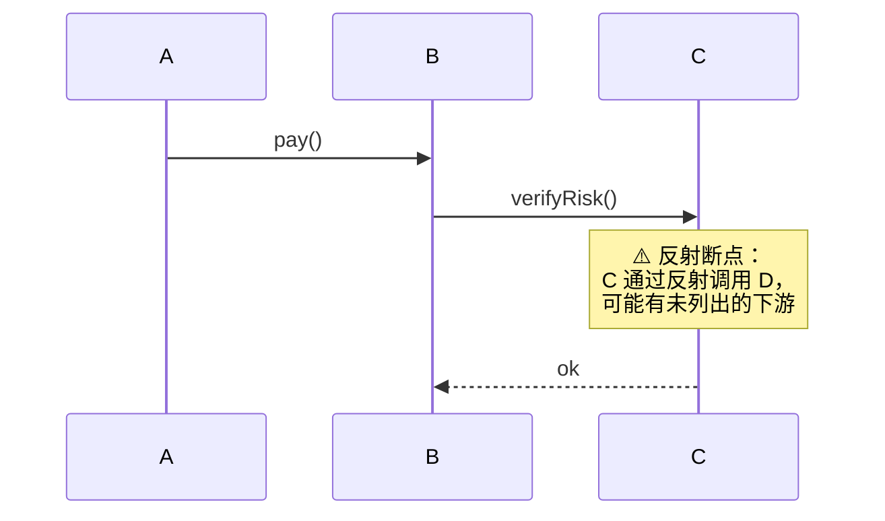

<!-- MODULE: call-chain-derivation -->
<!-- STATUS: TODO -->
<!-- LAST_ANALYZED: -->
<!-- ANALYZER_VERSION: 1.6 -->

# 业务调用链推导流程

> 本工作流建立在 [15-module-inventory.md](./15-module-inventory.md) 的模块台账之上，负责从"任意入口点"出发，**利用模块档案的三段依赖关系（上游依赖 / 下游调用方 / 下游数据调用）与入口点章节，推导出跨模块的完整业务调用链**。
>
> **核心价值**：Agent 无需 grep 代码，仅凭台账即可回答：
> - "这条业务从入口到落库经过哪些模块？"
> - "我改这个接口会影响哪些下游？"
> - "谁触发了这个数据表的写入？"
> - "这个 MQ topic 有多少个订阅方？会带出哪些副作用？"
>
> **前置条件**：`.agent-workflow/modules/` 下**至少存在建档模块 + 有效索引**。台账未建成或时效性未通过，本工作流拒绝执行（见 Step 0）。

---

## 概述

<!-- CONTENT_START: overview -->
本工作流规定了：

1. **推导前置检查** — 台账时效性硬门禁 + **已推导链路复用检查**（v1.8 新增）
2. **入口点识别** — 从用户任务/关键词定位链路起点
3. **链式跳转算法** — 基于三段依赖关系做 BFS 扩展，含**成环检测与剪枝**
4. **分叉表达约定**（v1.7 新增）— 条件分叉 / 扇出（同步 vs 异步）/ 多态实现 / 事件总线四类分叉的统一标注规范
5. **MQ 隐式调用消解** — 通过独立的 `_topics.md` 反查表连接发布方与订阅方
6. **动态调用与断点标注** — 反射/DI/事件总线等静态穿不过的位置显式告警
7. **输出格式** — Mermaid 时序图 / 流程图 + 影响面表 + 风险清单
8. **落档与复用**（v1.8 新增）— 推导产物默认写入 `chains/<slug>.md`，跨会话可复用；沿途模块变更时由 15 Step 5.5 联动置为 `STALE`

> 💡 **v1.7 关键增强**：调用链本质是**图**而非**线**——同一入口在不同条件、扇出、多态下会分叉出多条链路。v1.7 在 Step 2 加入成环剪枝、新增 Step 2.5 明确分叉的语义标签与图形约定，避免不同 Agent 输出的分叉图差异过大。
>
> 💡 **v1.8 关键增强**：把推导产物**长期化**为 `.agent-workflow/chains/*.md` 档案。首次推导落档 `STATUS = DERIVED`，用户核对后升级为 `VERIFIED`；沿途模块档案更新时由 15 联动降级为 `STALE`（不自动重推，等用户显式触发）。这样跨会话之间 Agent 可直接复用已推导链路，避免重复扫代码浪费 tokens。
<!-- CONTENT_END: overview -->

---

## 触发指令

### 用户手动触发

```
# 正向链路推导（我调了谁 → 一路到底）
画出 <入口/接口名> 的调用链
<业务名> 从入口到落库的全流程
<业务名> 涉及哪些模块

# 反向影响面（谁调了我 → 一路上溯）
分析 <模块.接口> 的影响面
如果我改 <接口> 会影响谁

# 数据反查
谁写入了 <表名/topic 名>
<资源> 的所有调用来源

# 定深探索
<入口> 深度=3 的调用链

# v1.8 新增：链路档案管理
列出已推导的调用链              # 展示 chains/index.md
刷新调用链档案 <slug>            # 强制重推并覆盖旧档案
作废调用链 <slug>                # STATUS 置为 ABANDONED
确认调用链 <slug>                # STATUS: DERIVED → VERIFIED

# v1.8 新增：临时不落档
画出 <入口> 的调用链 --no-persist   # 仅对话输出，不写入 chains/
```

### Agent 自动触发（可选启用）

以下场景 Agent **建议**主动执行本流程（非强制）：

| 触发时机 | 应执行的动作 |
|---------|------------|
| 用户任务涉及"跨模块联动"关键词（联动 / 全链路 / 端到端 / 影响面 / 波及） | 主动推导链路后再规划改动 |
| 修改了标注为「🔒 稳定」的对外接口（见模板核心接口章节） | 反向推导影响面并输出给用户 |
| Bug 修复任务无法在单一模块内定位到根因 | 从 Bug 表现的入口点正向推导 |

> ⚠️ 与 15 不同，16 **不是**每次代码修改都强制启动，而是"按需"启动。避免为改一行代码就画整张链路图。

---

## Step 0 · 前置门禁（硬性）

推导前必须通过以下四项校验，任一不通过则拒绝执行并向用户说明原因：

| 校验项 | 要求 | 未通过处置 |
|-------|------|----------|
| **台账存在** | `.agent-workflow/modules/index.md` 存在且至少有 1 条有效模块行 | 提示用户先执行 [15 Step 3 首次台账建立](./15-module-inventory.md#step-3--首次台账建立流程) |
| **沿途模块时效** | 推导过程中经过的**每个模块**档案时效状态非 🔴 | 沿途遇 🔴 → 先执行 [15 Step 5 增量更新](./15-module-inventory.md#step-5--增量更新流程自动--手动共用) 再继续 |
| **推导深度合规** | 用户显式指定深度 ≤ 20，或使用默认深度（5） | 超限时要求用户降级或分段推导 |
| **已推导链路复用**（v1.8 新增） | 读 `.agent-workflow/chains/index.md`，按 `CHAIN_TYPE + ENTRY_POINT` 精确匹配 → 命中且 `STATUS ∈ {DERIVED, VERIFIED}` → 直接加载复用，跳过 Step 1-5 重推 | 命中 `STALE` → 提示用户是否 `刷新调用链档案 <slug>`；命中 `ABANDONED` → 视为无匹配，走完整推导流程 |

### 0.4 复用命中处理协议（v1.8 新增）

命中已推导链路时，Agent 必须：

1. 向用户显式声明加载来源：`✅ 已加载 chains/<slug>.md（推导时间: X, 状态: Y, 沿途模块: N 个）`
2. 直接展示档案中的 mermaid 图 + 分叉分析 + 断点风险，不得重扫代码
3. 若 STATUS = `DERIVED`（未核对），追加提示：`⚠️ 该链路首次推导后未经人工核对，请 review 后回复

---

## Step 1 · 入口点识别

链路要有起点。Agent 按以下优先级识别起点：

### 1.1 显式指定（最高优先级）

用户直接给出起点，如：
- HTTP 路径 `POST /api/order/create`
- 函数名 `CreateOrder`
- MQ topic `topic:order.created`
- 数据库表 `t_order`
- 定时任务 cron 表达式

Agent 直接使用，跳过后续识别。

### 1.2 关键词匹配（默认路径，v1.9 三级下钻）

从 v1.9 开始，`modules/` 采用**分层结构**（Group / 顶层单模块两层），入口点匹配相应升级为三级按需加载：

**L1 · 顶层匹配**（硬性入口）：

1. 读取 [`modules/index.md`](../modules/index.md)，用任务描述关键词匹配「关键词」列
2. 命中目标分两种：
   - **顶层单模块**（行属性 `TYPE = MODULE`）→ 直接跳 L3加载 `modules/<module>.md`
   - **大模块 Group**（行属性 `TYPE = GROUP`）→ 进入 L2 下钻

**L2 · 组内下钻**（仅 Group 命中时）：

1. 读取 `modules/<group>/group.md`，用二级关键词匹配「子模块清单」表的「关键词」列
2. 命中子模块 → 进入 L3加载 `modules/<group>/<sub-module>.md`
3. 未命中子模块但命中 Group 本身的入口点（group.md 的「Group 级对外接口」段）→ 以 group.md 作为推导起点

**L3 · 入口点二次匹配**（模块内部）：

1. 在具体模块档案的「入口点（Entry Points）」表中做二次匹配：
   - HTTP 路径含关键词
   - 触发函数名含关键词
   - 说明列含关键词
2. 若匹配到 1 个入口 → 直接使用；≥70 → 列出候选让用户选择

> 💡 **三级下钻的 token 收益**：需定位单个模块时，只需读顶层 index (少 rows) + group.md (少 rows) + 目标模块 1 份，而非一次性扫全部模块。

### 1.3 反查起点（数据反查场景）

用户问"谁写入了 t_xxx 表"这类问题时：

1. 遍历所有模块档案的「下游数据/接口调用」章节
2. 匹配数据库表名 / topic / Redis key 模式
3. 命中的模块作为起点集合，进入 Step 2 反向遍历

---

## Step 2 · 链式跳转算法

### 2.1 正向遍历（默认，回答"入口→落库"类问题）

从起点模块开始 BFS，**必须使用 visited 集合做成环剪枝**：

```
初始化：
  visited = {}                 // 已展开过的模块集合，防止成环重复展开
  queue = [(起点模块, depth=0, path=[起点])]
  chain_edges = []
  cycle_warnings = []          // v1.7 新增：成环告警清单

while queue 非空:
  (current, depth, path) = queue.pop()

  # 深度上限（见 2.4）
  if depth > 最大深度:
    continue

  # 成环剪枝（v1.7 新增，硬性要求）
  if current ∈ visited:
    # 判断是否为回环（当前 path 中已经出现过 current）
    if current ∈ path:
      cycle_warnings.append("⚠️ 成环: " + " → ".join(path) + " → " + current)
      chain_edges.append((path[-1], current, edge_type="cycle-back"))
    # 无论是否成环，已展开过的模块不再二次展开
    continue

  visited.add(current)

  加载 current 模块档案，读取：
    (a) 「核心接口」— 记录本模块暴露给下游的能力
    (b) 「下游数据/接口调用」— 记录外部资源边界
    (c) 「下游调用方」— 【正向遍历不使用此项】

  正向传播（重点）：读 current 模块档案的「上游依赖」章节：
    — 语义等价："current 依赖了谁" → 那些人是被 current 触发的下一跳
    — ⚠️ 注意方向：正向链路是"入口触发下游"，因此要读的是
       "current 的入口函数中调用了哪些其他模块的接口"，
       这在档案中体现为 current 的「上游依赖」条目

  对于「下游数据/接口调用」中的 MQ 发布：
    查 _topics.md，找到订阅方模块列表 → 每个订阅方作为分叉分支加入 queue
    （见 Step 2.5 关于扇出分叉的表达约定）

  对于「上游依赖」中的每个下一跳模块 M：
    分叉类型 = 从档案中识别（见 Step 2.5）：conditional / fan-out / polymorphic / event-bus / normal
    queue.push((M, depth+1, path + [M]))
    chain_edges.append((current, M, edge_type=分叉类型))
```

**关键澄清（防错向）**：
- 正向链路走的是"当前模块调用别人" → 在档案术语里是「上游依赖」
- 反向链路走的是"别人调用当前模块" → 在档案术语里是「下游调用方」
- MQ 发布是本模块主动的动作 → 归入正向传播（通过 `_topics.md` 找订阅方作为下一跳）

**成环剪枝规则（v1.7 硬性要求）**：
- 每次展开新模块前，先检查它是否已在**当前 path**（当前从起点到 current 的路径）中
- 若已在 → **立即终止该分支**，在图上画到"回到 X"就停止，并加 ⚠️ 成环标注
- 若不在 path 但在 visited（历史其他分支已展开过）→ 视作"共享子图"，画一条边指向已存在节点，不再二次展开（用 `↩ 已访问` 标注）

### 2.2 反向遍历（回答"影响面/谁调我"类问题）

从起点模块开始逆向 BFS：

```
初始化：
  visited = {}
  queue = [起点模块]
  impact_edges = []
  depth = 0

while queue 非空 且 depth < 最大深度:
  current = queue.pop()
  visited.add(current)

  加载 current 模块档案，读取：
    「下游调用方」— 谁调了我

  对于每个调用方模块 M：
    if M ∉ visited:
      queue.push(M)
      impact_edges.append(M → current)   // 注意方向：M 依赖 current

  # 反向的 MQ 消解：
  # 若 current 存在于某个 topic 的订阅方列表 → 该 topic 的发布方也是"影响我的上游"
  遍历 _topics.md，找到订阅方包含 current 的行：
    该行的发布方模块加入 queue
```

### 2.3 双向遍历（数据反查场景）

用户问"谁写入了 t_xxx 表"时：

1. 用 Step 1.3 得到起点集合 S
2. 对 S 中每个模块，向上做**反向遍历**（Step 2.2），得到"数据入口路径"
3. 对 S 中每个模块，展示"该模块内哪些函数触发了该数据资源写入"（读档案「核心接口」）

### 2.4 深度限制

- **默认深度**：5 跳
- **强制上限**：20 跳（超出必须报错）
- **级联深度**：仅遍历"模块间调用关系"，模块内的函数级调用不计入深度
- **短路条件**：
  - 当前 path 中已存在（成环）→ 短路，标注 `⚠️ 成环，回到 X`（v1.7 新增）
  - 已访问但不在 path（共享子图）→ 短路，标注 `↩ 已访问`
  - 遇到 ⚪ 未建档模块 → 短路，标注 `⚪ 未建档`
  - 遇到 🔴 已过期模块且用户拒绝先刷新 → 短路，标注 `🔴 数据过期，链路可能失真`

---

## Step 2.5 · 分叉表达约定（v1.7 新增，硬性规范）

> 调用链的本质是图，同一入口经常会分叉成多条链路。本节规定 4 类分叉的**统一语义标签与 mermaid 图形约定**，避免不同 Agent 输出的图差异过大。

### 2.5.1 四类分叉的识别与标注

| 分叉类型 | 识别方式 | 语义 | mermaid 图形约定 |
|---------|---------|------|-----------------|
| **条件分叉**（conditional） | 档案「注意事项」或「核心接口」注明 if/switch/策略模式 分派下游；或方法名/字段名带 channel/type/mode 等分派语义 | 运行时**只走一条**，静态推导必须列全 | 使用 mermaid alt/else 语法 + **必须**在分支上标注条件表达式（示例见 2.5.3） |
| **同步扇出**（sync fan-out） | 档案「上游依赖」中一次调用触发 ≥2 个下游、且是**同步**返回值合并（Promise.all / errgroup / CompletableFuture.allOf 等） | 运行时**同时**走多条，任一失败 → 主链失败 | 每条分支用**实线箭头**，边标签**必须以 `sync:` 前缀**开头（如 `sync: reduce()`） |
| **异步扇出**（async fan-out） | MQ 一发多订、EventBus 触发多 handler、`go func()` / 线程池并发投递等 | 运行时**同时**走多条，失败降级不影响主链 | 每条分支用**虚线箭头** `--)` 或 `-->>`，边标签**必须以 `async:` 前缀**开头（如 `async: order.paid`） |
| **多态实现**（polymorphic） | 档案「核心接口」标注了 interface 类型且档案登记了 ≥2 个实现（含 DI 多实现登记） | 静态**无法确定运行时走哪条**，需平行画出所有可能 | 每条分支用**空心菱形箭头**或边标签以 **`possible:` 前缀**开头（如 `possible: MySQLStorage.Save`），并在图上加 `Note over X: ⚠️ 多态分叉` |
| **事件总线**（event-bus） | 档案「注意事项」或「入口点」明确声明"内存事件总线注册"，非 MQ | 运行时**同时**触发所有订阅 handler，静态需列全 | 与 async fan-out 同规范（虚线 + `async:` 前缀），并额外在起点加 `Note: ⚠️ 事件总线断点，可能有反射注册的 handler 未列出` |

> 📌 若同一分叉点混合了多种类型（如 event-bus 内部含 conditional），按**外层类型**画主图，内层类型在 Note 中说明。

### 2.5.2 分叉在档案中的标注建议（写入 modules/*.md 时）

模块档案的「上游依赖」「下游数据/接口调用」段落书写时，建议对分叉点显式标注：

```markdown
## 上游依赖（我依赖谁）

- payment：sync 调用 pay(channel)
  - conditional 分派：channel==wechat → wechat-adapter；channel==alipay → alipay-adapter
- storage：polymorphic 接口，实现登记 = MySQLStorage / RedisStorage
- notification：async 触发（通过 topic:order.paid，见 _topics.md）
```

Agent 在推导时读取到这类标注即可自动识别分叉类型，无需二次扫代码。

### 2.5.3 mermaid 输出的最小规范示例

**条件分叉**（alt/else 语法，必须标注条件）：

```
sequenceDiagram
    Client->>Payment: pay(channel)
    alt channel == "wechat"
        Payment->>WechatSDK: unifiedOrder()
    else channel == "alipay"
        Payment->>AlipaySDK: tradeCreate()
    end
```

**同步扇出 vs 异步扇出**（前缀区分）：

```
sequenceDiagram
    Order->>Inventory: sync: reduce()
    Order->>ES: sync: index()
    Order--)Notification: async: order.paid
    Order--)Points: async: order.paid
```

**多态实现**（possible 前缀 + Note）：

```
sequenceDiagram
    App->>Storage: save(x)
    Note over Storage: ⚠️ 多态分叉<br/>possible: MySQLStorage / RedisStorage
    Storage-->>MySQL: possible: 落库
    Storage-->>Redis: possible: 落缓存
```

**成环剪枝**（cycle-back 边）：

```
sequenceDiagram
    A->>B: call
    B->>C: call
    C->>A: ⚠️ 成环: A→B→C→A（此处终止展开）
```

### 2.5.4 何时不使用 alt/else（常见误用）

- ❌ 把**同步扇出**写成 alt/else（那是并发不是二选一）
- ❌ 把**多态实现**写成 alt/else（那是运行时不确定，不是运行时选择）
- ❌ 把**已过期/未建档**画成分叉（那是断点，不是分叉，用 Note 标注即可）

---

## Step 3 · MQ 隐式调用消解

### 3.1 `_topics.md` 反查表规范

在 `.agent-workflow/modules/` 下维护一个独立文件 `_topics.md`（下划线开头，不参与模块分析），格式：

```markdown
# 消息队列 Topic 反查表

<!-- LAST_ANALYZED: YYYY-MM-DD -->

| Topic | 消息类型 | 发布方模块 | 订阅方模块 | 关键字段 |
|-------|---------|-----------|-----------|---------|
| topic:payment.result | Kafka | payment | order, notification | orderId, status, amount |
| topic:order.created  | Kafka | order   | inventory, coupon, report | orderId, userId, items |
| topic:auth.login     | Kafka | auth    | audit, notification | userId, ip, loginType |
```

### 3.2 生成规则

`_topics.md` 由 15 版工作流的 Step 5 增量更新时**顺带聚合**，规则：

1. 遍历所有模块档案的「下游数据/接口调用」章节
2. 提取「消息队列」段落中的每一条：
   - 若标注为「发布」→ 该模块进入对应 topic 的**发布方**列
   - 若标注为「订阅」→ 该模块进入对应 topic 的**订阅方**列（模块的入口点章节也应有对应的 MQ 消费入口）
3. 按 topic 名去重合并
4. 更新 `<!-- LAST_ANALYZED -->` 头

### 3.3 冲突检测

生成过程中若发现：

- 某 topic 有 2 个及以上发布方 → 输出告警 `⚠️ topic 多发布方，语义可能不清`
- 某 topic 有发布方但无订阅方 → 输出告警 `⚠️ 孤儿 topic，订阅方可能未建档`
- 某模块入口点声明订阅了某 topic，但没有任何模块声明发布该 topic → 输出告警 `⚠️ 无发布方的订阅`

告警统一写入 `_topics.md` 末尾的「## 一致性告警」段落。

---

## Step 4 · 动态调用与断点标注

以下场景静态扫描无法穿过，Agent 必须**明确标注断点**而不是假装完整：

| 断点类型 | 识别方式 | 标注符号 | 分叉处理（v1.7） |
|---------|---------|---------|-----------------|
| **反射调用** | 模块档案「注意事项」中显式声明"通过反射注入"，或代码扫描到反射 API | `⚠️ 反射断点` | 单点断开，不视为分叉 |
| **DI 容器** | 使用 IoC 容器注入的依赖，档案「上游依赖」标注 `via DI` | `⚠️ DI 断点` | 若 DI 有多实现登记则按 `polymorphic` 处理 |
| **事件总线** | 内存事件总线（非 MQ），档案「注意事项」显式声明 | `⚠️ 事件总线断点` | 按 Step 2.5 `event-bus` 分叉规范处理，逐一列出订阅者 |
| **接口多态** | 档案「核心接口」标注了 interface 类型，且档案登记了 ≥2 个实现 | `⚠️ 多态分叉` | 按 Step 2.5 `polymorphic` 分叉规范处理，附「实现清单」表 |
| **成环** | 展开时发现 current ∈ path（v1.7 新增） | `⚠️ 成环` | 画到"回到 X"停止，边标签 `cycle-back` |
| **未建档下游** | 遇到 ⚪ 未建档模块 | `⚪ 未建档` | 单点断开 |
| **数据过期** | 遇到 🔴 已过期模块 | `🔴 数据可能失真` | 单点断开 |

**断点在链路中的表现**：



---

## Step 5 · 输出格式规范

> ⚠️ **v1.8 落档默认开启**：Step 5 输出的**正文内容**（元信息 + mermaid 图 + 沿途外部资源 + 分叉分析 + 断点风险）**必须同时**写入 `.agent-workflow/chains/<slug>.md` 档案（详见 Step 6 落档规范）与对话中呈现。除非用户显式追加 `--no-persist`，Agent **不得**跳过落档。

### 5.1 正向调用链输出

```markdown
## 调用链推导：<入口标识>

**推导范围**：起点 <A> → 深度 5 跳
**沿途模块**：A, B, C, D, E（共 5 个，全部 🟢 有效）

### 时序图

​```mermaid
sequenceDiagram
    participant Client
    participant A as A 模块
    participant B as B 模块
    ...
    Client->>A: HTTP POST /api/xxx
    A->>B: b.doSomething()
    B->>DB: INSERT INTO t_xxx
    B-->>A: result
    A-->>Client: 200 OK
​```

### 沿途外部资源

| 模块 | 数据库表 | Redis Key | MQ Topic | 外部 HTTP |
|------|---------|-----------|----------|----------|
| A    | -       | session:* | -        | -        |
| B    | t_xxx   | -         | topic:xxx (发布) | - |

### 断点与风险

- ⚠️ B → 反射断点：B 通过反射调用 D，可能有未列出的下游
- ⚪ E → 未建档：链路在此终止，建议对 E 建档后重新推导
```

### 5.2 反向影响面输出

```markdown
## 影响面分析：<模块.接口>

**推导范围**：起点 <模块.接口> → 反向 3 层
**受影响模块总数**：8 个

### 影响面清单

| 距离 | 受影响模块 | 使用了哪些接口 | 风险等级 |
|:----:|-----------|--------------|:--------:|
| 1 层 | api-gateway | verifyAccessToken (47 处) | 🔴 高 |
| 1 层 | admin-panel | getMe (12 处) | 🟡 中 |
| 2 层 | notification | 通过 gateway 间接调用 | 🟢 低 |
| ...  | ...       | ...          | ...      |

### 建议改动策略

- 高风险：必须联动改动，否则编译失败
- 中风险：接口签名兼容时可保留旧路径 + 新增新路径灰度
- 低风险：仅需通知维护方，无强制联动
```

### 5.3 数据反查输出

```markdown
## 数据资源反查：`t_xxx`

**触达该资源的模块**：3 个
**触达路径深度**：最大 3 层

### 写入方
| 模块 | 触发接口 | 入口点 | 频次估计 |
|------|---------|--------|---------|
| A    | createXxx | POST /api/xxx | 高 |
| B    | fixXxx  | CLI: fix-xxx | 极低（运维） |

### 读取方
| 模块 | 用途 | 入口点 |
|------|------|--------|
| C    | 展示 | GET /api/xxx |
```

### 5.4 分叉图输出示例（v1.7 新增）

> 演示条件分叉 / 同步扇出 / 异步扇出 / 多态 / 成环 5 类混合分叉的完整表达。

```markdown
## 调用链推导：POST /api/order/pay（含分叉示例）

**推导范围**：起点 order → 深度 4 跳
**沿途模块**：order, payment, wechat-adapter, alipay-adapter, storage(interface), notification, points, analytics
**分叉统计**：条件分叉 1 处 / 同步扇出 1 处 / 异步扇出 1 处 / 多态 1 处 / 成环 0 处

### 时序图（含分叉标注）

​```mermaid
sequenceDiagram
    participant Client
    participant Order as order 模块
    participant Payment as payment 模块
    participant Wechat as wechat-adapter
    participant Alipay as alipay-adapter
    participant Storage as storage (interface)
    participant MySQL as MySQLStorage (可能)
    participant Redis as RedisStorage (可能)
    participant Notify as notification
    participant Points as points

    Client->>Order: POST /api/order/pay
    Order->>Payment: pay(channel)

    alt if: channel==wechat
        Payment->>Wechat: sync: unifiedOrder
    else if: channel==alipay
        Payment->>Alipay: sync: tradeCreate
    end

    Payment->>Storage: sync: save(paymentRecord)
    Note over Storage: ⚠️ 多态分叉<br/>possible: MySQLStorage / RedisStorage
    Storage-->>MySQL: possible: 落库（生产环境）
    Storage-->>Redis: possible: 落缓存（测试环境）

    Payment-->>Order: result
    Order--)Notify: async: order.paid（MQ）
    Order--)Points: async: order.paid（MQ）
    Order-->>Client: 200 OK
​```

### 分叉分析

| 位置 | 分叉类型 | 关键条件 / 实现 | 影响 |
|------|---------|----------------|------|
| Payment.pay | conditional | `channel ∈ {wechat, alipay}` | 运行时二选一，两条分支都需回归测试 |
| Storage.save | polymorphic | MySQLStorage / RedisStorage | 生产走 MySQL，测试走 Redis，改 interface 需两套实现同步 |
| Order → 消息发布 | async fan-out | topic:order.paid → notification, points | 失败降级不影响主链，但需监控订阅方消费成功率 |

### 断点与风险

- ⚠️ 多态分叉（Storage）：静态无法确定运行时走 MySQL 还是 Redis，需查配置
- ⚠️ 异步扇出（order.paid）：订阅方 notification/points 若失败仅告警，不阻塞主链
```

---

## Step 6 · 落档规范（v1.8 新增，硬性）

> Step 5 输出的正文必须**同时**写入 `chains/<slug>.md`。本节规定 slug 命名、文件头元数据、STATUS 状态机、SOURCE_MODULES_SNAPSHOT 生成方式与变更历史追加规则。

### 6.1 slug 命名规则（硬性）

```
<chain-type>-<entry-slug>.md
```

- `<chain-type>` ∈ `forward` / `reverse` / `data-lookup`（对应 Step 2.1 / 2.2 / 2.3）
- `<entry-slug>` — 入口标识的 kebab-case 化：
  - HTTP 入口：`api-order-pay`（`POST /api/order/pay` → 去动词与斜杠）
  - 函数入口：`user-svc-login`（`UserSvc.Login` → 小写连字符）
  - topic 入口：`topic-order-created`
  - 表反查入口：`table-t-order`

**示例**：`forward-api-order-pay.md` / `reverse-user-svc-login.md` / `data-lookup-table-t-user.md`

### 6.2 文件头元数据（必填）

```markdown
<!-- CHAIN: forward-api-order-pay -->
<!-- CHAIN_TYPE: forward -->
<!-- ENTRY_POINT: POST /api/order/pay -->
<!-- DEPTH: 5 -->
<!-- STATUS: DERIVED -->
<!-- LAST_DERIVED: 2026-07-01 -->
<!-- LAST_VERIFIED: - -->
<!-- SOURCE_MODULES_SNAPSHOT: order@2026-06-28, payment@2026-06-28, storage@2026-06-27 -->
<!-- ANALYZER_VERSION: 1.5 -->
```

### 6.3 SOURCE_MODULES_SNAPSHOT 生成方式（v1.9 升级：带路径）

- 遍历 Step 2 展开过的所有模块（visited 集合）
- 对每个模块读取其 `modules/<name>.md` 或 `modules/<group>/<name>.md` 头部的 `LAST_ANALYZED` 值
- **拼接格式（v1.9）**：
  - 顶层单模块：`<module-name>@<YYYY-MM-DD>`（例：`payment@2026-06-30`）
  - Group 内子模块：`<group>/<module-name>@<YYYY-MM-DD>`（例：`core/agent-loop@2026-06-30`）
- 多个模块用逗号分隔：`SOURCE_MODULES_SNAPSHOT: core/agent-loop@2026-06-30, llm/deepseek-adapter@2026-06-28, payment@2026-06-25`
- 该字段是**时效判定的唯一依据**，STALE 时不得清空该字段（保留旧快照供追溯）

> ⚠️ **v1.9 向后兼容：**旧版本不带路径的快照（如 `agent-loop@2026-06-30`）仍可读取，15 Step 5.5 失效判定时优先按带路径匹配，退化后按单模块名匹配。重推时自动升级为带路径格式。

### 6.4 STATUS 状态机

| 当前状态 | 事件 | 新状态 | 触发方 |
|---------|------|-------|-------|
| （无档案） | 首次推导 | `DERIVED` | Agent（Step 5 落档） |
| `DERIVED` | 用户回复"确认"或触发 `确认调用链 <slug>` | `VERIFIED` | 用户 |
| `DERIVED` / `VERIFIED` | 沿途某模块 `LAST_ANALYZED` 变更（15 Step 5.5 联动） | `STALE` | 15 Step 5.5 |
| `STALE` | 用户触发 `刷新调用链档案 <slug>` | `DERIVED`（等待再次核对） | 用户 |
| `DERIVED` / `VERIFIED` / `STALE` | 用户触发 `作废调用链 <slug>` | `ABANDONED` | 用户 |

> ⚠️ **禁止**：Agent 不得自作主张把 `DERIVED` 升级为 `VERIFIED`；`VERIFIED` 必须由用户显式触发。

### 6.5 变更历史（Change Log）追加规则

每份链路档案都必须维护一个「变更历史」表格，遵循**只追加、不修改**：

| 事件 | 追加时机 | 追加者 |
|------|---------|-------|
| `首次推导` | Step 5 首次落档 | Agent |
| `用户核对通过` | STATUS: DERIVED → VERIFIED | Agent（用户触发确认时） |
| `联动置为 STALE` | 15 Step 5.5 检测到沿途模块更新 | 15（自动） |
| `用户触发重推` | STATUS: STALE → DERIVED，同时刷新 `SOURCE_MODULES_SNAPSHOT` | Agent |
| `用户作废` | STATUS → ABANDONED | Agent |

### 6.6 `--no-persist` 例外

用户在触发词末尾追加 `--no-persist` 时（如 `画出 POST /api/order/pay 的调用链 --no-persist`），Agent **仅对话输出**，不写 `chains/` 且不更新 `chains/index.md`。适用于一次性探索、临时假设分析等场景。

### 6.7 反向索引维护（v1.9 新增，硬性）

> 目的：让**模块档案 ↔ 链路档案**互相可导航。链路落档时反向向沿途模块档案、以及涵盖子模块所在的 Group 档案双向注入引用。

每次执行 Step 6（首次落档或刷新重推）后，Agent **必须**执行以下反向索引维护动作：

1. 遍历本链路 `SOURCE_MODULES_SNAPSHOT` 中的每个模块：
   1.1 打开对应模块档案（`modules/<group>/<module>.md` 或 `modules/<module>.md`）
   1.2 将本链路的 slug 追加到头部 `<!-- INVOLVED_CHAINS: ... -->` 字段（逗号分隔，已存在则去重，空列表 `-` 则替换为 slug）
2. 对属于 Group 的子模块额外更新其 `<group>/group.md` 的「涉及的调用链档案」表：
   2.1 若本链路 slug 尚未在表中 → 追加一行，填写链路 slug / 类型 / 起点 / 状态 / 时效
   2.2 若已存在 → 同步更新状态/时效列
3. 作废链路（STATUS → ABANDONED）时，反向从沿途模块档案头部 `INVOLVED_CHAINS` 中**移除**该 slug；同步从 Group 的「涉及的调用链档案」表移除对应行
4. 若使用了 `--no-persist` 例外，本步骤同步跳过（不落档则不反向注入）

**设计意图**：

- 链路档案的 `SOURCE_MODULES_SNAPSHOT` = "链路 → 模块" 的正向引用（一直需要，时效判定依据）
- 模块档案的 `INVOLVED_CHAINS` = "模块 → 链路" 的反向引用（方便 Agent 从模块开始定位业务链）
- Group 档案的「涉及链路」表 = Group 级聚合视图（快速看到"本 Group 参与了哪些业务链"）

> 📌 本步骤与 15 Step 5.5 的区别：15 Step 5.5 是模块刷新 → 链路 STALE，本步 6.7 是链路落档 → 反向注入模块，两者方向相反，共同组成双向循环完整性。

---

## Step 7 · 时效性维护（v1.8 新增）

### 7.1 时效判定算法

Agent 加载已有链路档案前必须做时效判定：

```
读取 chains/<slug>.md 的 SOURCE_MODULES_SNAPSHOT
对每个 <module@date> 项：
  读取 modules/<module>.md 头部当前 LAST_ANALYZED
  若 当前 LAST_ANALYZED > 快照 date：
    该模块已更新 → 链路时效状态 = STALE
```

- 任一模块不一致即整条链路视为 STALE
- STALE 判定**不修改档案 STATUS**（STATUS 由 15 Step 5.5 统一置位）；仅在加载时提示用户

### 7.2 STALE 加载协议

Agent 加载 STALE 链路时**不自动重推**，仅明确提示：

```
⚠️ 链路 chains/<slug>.md 已过期
  - order 模块 LAST_ANALYZED 由 2026-06-28 更新为 2026-08-15
  - payment 模块 LAST_ANALYZED 由 2026-06-28 更新为 2026-08-10

选项：
  1. 输入 `刷新调用链档案 <slug>` 触发重推（推荐，会更新档案与快照）
  2. 输入 `继续使用当前档案` 强制加载（不推荐，链路可能失真）
  3. 输入 `作废调用链 <slug>` 若该链路已不再适用
```

### 7.3 触发词汇总

| 触发词 | 行为 |
|-------|------|
| `列出已推导的调用链` / `查看调用链档案` | 读 `chains/index.md` 输出档案清单表 |
| `刷新调用链档案 <slug>` | 按当前 modules 状态重推并覆盖旧档案；STATUS 回到 DERIVED；`SOURCE_MODULES_SNAPSHOT` 更新；「变更历史」追加 |
| `确认调用链 <slug>` / 用户回复"链路正确/已核对/verified" | STATUS: DERIVED → VERIFIED；追加「变更历史」 |
| `作废调用链 <slug>` | STATUS → ABANDONED；档案文件保留不删除 |

---

## Step 8 · 与其他工作流的协作

| 工作流 | 关系 |
|-------|------|
| [15-module-inventory.md](./15-module-inventory.md) | 提供三段依赖关系与入口点作为推导原料；本工作流启动前必须通过 15 的时效性门禁；**v1.8 新增：15 Step 5.5 每次刷新模块档案后，扫 `chains/index.md` 把涉及该模块的链路联动置为 STALE**（级联失效） |
| [07-bug-fixing.md](./07-bug-fixing.md) | Bug 定位阶段可先执行本工作流的正向推导，从 Bug 表现的入口一路追到根因位置；已有档案可复用（v1.8） |
| [08-code-review.md](./08-code-review.md) | Code Review 阶段可执行反向推导，评估改动的影响面；v1.8 起 review 时可直接引用 `chains/reverse-*.md` 已推导档案 |
| [12-pull-request.md](./12-pull-request.md) | PR 描述可附带本工作流的影响面输出 / 直接引用 `chains/<slug>.md` 档案链接，便于评审 |

---

## 相关文件

<!-- CONTENT_START: related_files -->
- `.agent-workflow/workflows/15-module-inventory.md` — 台账建设与维护（本工作流的数据源）
- `.agent-workflow/modules/index.md` — 模块索引（关键词匹配起点）
- `.agent-workflow/modules/_topics.md` — MQ topic 反查表（本工作流的辅助索引）
- `.agent-workflow/modules/*.md` — 单个模块档案（推导时按需加载）
- `.agent-workflow/templates/module-template.md` — 档案模板（含入口点章节）
- `.agent-workflow/chains/index.md` — **v1.8 链路档案索引**（Step 0.4 复用检查入口）
- `.agent-workflow/chains/*.md` — **v1.8 链路档案**（Step 5-6 落档产物，跨会话复用）
- `.agent-workflow/templates/chain-template.md` — **v1.8 链路档案模板**（Step 6 落档骨架）
<!-- CONTENT_END: related_files -->

---

## 备注

<!-- CONTENT_START: notes -->
- 本工作流强调"**诚实优先**"：宁可标注断点也不假装完整。链路推导的价值在于"信息可信"，一旦引入猜测就会误导后续改动
- 深度限制是防止大项目遍历爆炸的关键，用户可显式扩展但需承担成本
- 函数级链路不在本工作流范围内。如需精确到函数，用户应在推导后对关键节点用 `grep_search` 补充调用点
- 若项目未使用 MQ，`_topics.md` 可保留但为空（表头 + 空表体），不影响其他能力
<!-- CONTENT_END: notes -->

---

<!-- DETECTION_HINTS:
  探测规则（Agent 使用本工作流时参考）：
  - 检查文件: .agent-workflow/chains/index.md（v1.8 复用命中检查入口）
  - 检查文件: .agent-workflow/modules/index.md（起点匹配）
  - 检查文件: .agent-workflow/modules/*.md 的「入口点」「上游依赖」「下游调用方」「下游数据/接口调用」章节
  - 检查文件: .agent-workflow/modules/_topics.md（MQ 反查）
  - 触发条件: 用户显式画链路 / 分析影响面 / 数据反查
  - 触发条件: 修改了 🔒 稳定接口时 Agent 主动反向推导
  - 输出目标（v1.8）: Mermaid 时序图 + 影响面表 + 风险清单，同时对话输出 + 落档 chains/<slug>.md
  - 复用契约（v1.8）: 命中已有档案且 STATUS ∈ {DERIVED, VERIFIED} → 直接加载复用，跳过 Step 1-5 重扫
-->
