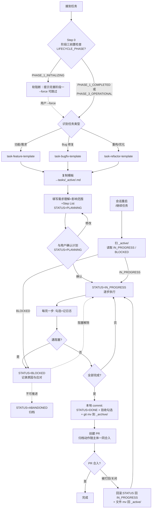

# 🤖 Agent 工作流文档

<!-- WORKFLOW_VERSION: 1.12 -->
<!-- ANALYZER_VERSION: 1.7 -->
<!-- LAST_UPDATED: 2026-08-17 -->
<!-- LIFECYCLE_PHASE: PHASE_1_COMPLETED -->
<!-- 注：LIFECYCLE_PHASE 元数据由 Agent 读取以做前置检查；下文「🔰 当前阶段状态」表是同一信息的人类可读视图，二者需保持同步。 -->

> 入口索引文件。流程文档：[workflows/](.agent-workflow/workflows/)，业务模块：[modules/](.agent-workflow/modules/)，调用链档案：[chains/](.agent-workflow/chains/)，研发任务：[tasks/](.agent-workflow/tasks/)，分析器指令：[analyzer-instructions](.agent-workflow/analyzer-instructions.md)，使用指南：[guide](.agent-workflow/guide.md)

---

## 🚀 快速开始

在任意支持对话的 AI Agent（Claude Code / Cursor / Windsurf / GitHub Copilot / Trae / Augment 等）中输入以下指令即可：

### 📐 阶段一：项目工作流分析（首次使用必须先完成）

| 场景                               | 指令示例                                             |
| ---------------------------------- | ---------------------------------------------------- |
| 整体分析（首次推荐，先预览后确认） | `分析项目工作流`                                     |
| 一键自动分析（跳过确认直接写入）   | `分析项目工作流 --auto`                              |
| 单模块分析                         | `分析编译流程` / `分析测试流程` / `分析分支提交规范` |
| 重新分析（覆盖自动生成内容）       | `重新分析编译流程模块`                               |
| 查看阶段一完善度评分               | `查看工作流完善度`                                   |
| **宣告阶段一完成**（解锁阶段三）   | `完成项目工作流分析`                                 |

### 📦 阶段二：业务模块分析（随时可用，独立进行）

| 场景                                      | 指令示例                                                                                   |
| ----------------------------------------- | ------------------------------------------------------------------------------------------ |
| 分析所有业务模块                          | `分析所有业务模块`                                                                         |
| 分析指定模块                              | `分析 user-auth 模块`                                                                      |
| 完善指定模块                              | `完善 user-auth 模块`                                                                      |
| **建立/刷新模块台账**（15 强化）          | `建立模块台账` / `刷新模块台账`                                                            |
| 局部刷新台账                              | `更新 <模块名> 模块台账` / `刷新最近改动的模块台账`                                        |
| 台账时效性体检                            | `检查模块台账时效性` / `体检模块台账`                                                      |
| **画业务调用链**（16 推导）               | `画出 <入口> 的调用链` / `<业务> 从入口到落库的全流程`                                     |
| 临时推导不落档（v1.8）                    | `画出 <入口> 的调用链 --no-persist`                                                        |
| 列出 / 确认 / 刷新 / 作废链路档案（v1.8） | `列出已推导的调用链` / `确认调用链 <slug>` / `刷新调用链档案 <slug>` / `作废调用链 <slug>` |
| 影响面分析                                | `分析 <模块.接口> 的影响面` / `如果我改 <接口> 会影响谁`                                   |
| 数据资源反查                              | `谁写入了 <表名/topic>` / `<资源> 的所有调用来源`                                          |
| 刷新 topic 反查表                         | `刷新 topic 反查表`                                                                        |

### 🛠️ 阶段三：开发维护任务（需阶段一完成后解锁）

| 场景                                  | 指令示例                                                      |
| ------------------------------------- | ------------------------------------------------------------- |
| **创建研发任务**（需求 / Bug / 重构） | `创建任务: 在订单页增加导出 Excel 按钮`                       |
| **查看 / 继续任务**                   | `查看进行中的任务` / `继续任务` / `继续任务 <task-id>`        |
| **归档任务**                          | `归档任务 20260526-add-oauth-login`                           |
| **废弃任务**                          | `废弃任务 20260526-add-oauth-login`                           |
| 创建分支 / PR（需 Git 平台能力）      | `创建 feature/add-login 分支` / `创建 PR：feature/x → master` |

### 🩺 治理：工作流自检（随时可用，不占阶段）

| 场景                                                       | 指令示例                          |
| ---------------------------------------------------------- | --------------------------------- |
| **启动全量自检**（检查 13 个流程 + 任务 SOP + 关键流闭环） | `启动工作流自检` / `自检工作流`   |
| 单流程自检                                                 | `自检 编译流程` / `自检 分支提交` |
| 关键流闭环检查                                             | `自检 关键流`                     |
| 查看上次报告 / 添加豁免                                    | `查看自检报告` / `忽略缺陷 #N`    |

> 💡 自检是**元流程**（SOP 的 Code Review），与阶段一完善度评分是两套体系：后者看“有没有写”，前者看“写得好不好”。详见 [`workflows/14-workflow-self-check.md`](.agent-workflow/workflows/14-workflow-self-check.md)。

> 💡 详细使用方法见 [.agent-workflow/guide.md](.agent-workflow/guide.md)，自动分析机制见 [analyzer-instructions.md](.agent-workflow/analyzer-instructions.md)。
>
> ⚠️ **默认预览确认机制**：分析指令默认会先输出预览报告并等待你确认，避免误覆盖；只有追加 `--auto` 才会跳过确认直接写入。

---

## 🔄 工作流生命周期

本工作流分为三个阶段，**阶段三依赖阶段一完成后才能解锁**。详细评分规则见 [lifecycle.md](.agent-workflow/lifecycle.md)。

|  阶段  | 名称              | 前置条件                               |
| :----: | ----------------- | -------------------------------------- |
| **一** | 📐 项目工作流分析 | 无（首次必做）                         |
| **二** | 📦 业务模块分析   | 无（随时可用）                         |
| **三** | 🛠️ 开发维护任务   | **阶段一完善度 ≥ 80 分且用户宣告完成** |

---

## 🔰 当前阶段状态

| 项目             | 状态                                 |
| ---------------- | ------------------------------------ |
| **当前阶段**     | 🟢 阶段一已完成（PHASE_1_COMPLETED） |
| **完善度得分**   | 94 / 100 分                          |
| **阶段三解锁**   | 🟢 已解锁（阶段三可正常创建任务）    |
| **上次分析时间** | 2026-08-17                           |

> 💡 输入 `查看工作流完善度` 刷新得分；输入 `完成项目工作流分析` 宣告阶段一完成并解锁阶段三。

---

## 📊 工作流程状态总览

| 序号  | 流程名称               |    状态     |  最后更新  |                                                      文档链接 |
| :---: | ---------------------- | :---------: | :--------: | ------------------------------------------------------------: |
|  01   | 项目说明               |  🟢 已完成  | 2026-08-17 |      [查看](.agent-workflow/workflows/01-project-overview.md) |
|  02   | 规则限制               |  🟢 已完成  | 2026-08-17 |     [查看](.agent-workflow/workflows/02-rules-constraints.md) |
|  03   | 开发流程               |  🟢 已完成  | 2026-08-17 |  [查看](.agent-workflow/workflows/03-development-workflow.md) |
|  04   | 编译流程               |  🟢 已完成  | 2026-08-17 |         [查看](.agent-workflow/workflows/04-build-process.md) |
|  05   | 测试流程               |  🟢 已完成  | 2026-08-17 |       [查看](.agent-workflow/workflows/05-testing-process.md) |
|  06   | 发布流程               | 🟡 部分完成 | 2026-08-17 |       [查看](.agent-workflow/workflows/06-release-process.md) |
|  07   | Bug排查修复            | 🟡 部分完成 | 2026-08-17 |            [查看](.agent-workflow/workflows/07-bug-fixing.md) |
|  08   | 代码Review             | 🟡 部分完成 | 2026-08-17 |           [查看](.agent-workflow/workflows/08-code-review.md) |
|  09   | 模块分析               |  🟢 已完成  | 2026-08-17 |       [查看](.agent-workflow/workflows/09-module-analysis.md) |
|  10   | 代码优化               | 🟡 部分完成 | 2026-08-17 |     [查看](.agent-workflow/workflows/10-code-optimization.md) |
|  11   | 分支提交               |  🟢 已完成  | 2026-08-17 |         [查看](.agent-workflow/workflows/11-branch-commit.md) |
|  12   | PR提交                 | 🟡 部分完成 | 2026-08-17 |          [查看](.agent-workflow/workflows/12-pull-request.md) |
|  13   | CI/CD流程              |  🔴 待实现  | 2026-08-17 |        [查看](.agent-workflow/workflows/13-ci-cd-pipeline.md) |
| 14 🔧 | 工作流自检（META）     | 🟢 模板自带 |    N/A     |   [查看](.agent-workflow/workflows/14-workflow-self-check.md) |
| 15 🔧 | 模块台账（阶段二强化） | 🟢 模板自带 |    N/A     |      [查看](.agent-workflow/workflows/15-module-inventory.md) |
| 16 🔧 | 业务调用链推导         | 🟢 模板自带 |    N/A     | [查看](.agent-workflow/workflows/16-call-chain-derivation.md) |

**状态说明**：🔴 待实现（TODO） | 🟡 部分完成（PARTIAL） | 🟢 已完成（DONE） | 🟢 模板自带（META，不计入完善度评分，`LAST_ANALYZED` 固定为 `N/A`）

> 🔧 **META 标记说明**：序号带 🔧 的是元流程/治理层能力（14 自检、15 模块台账、16 调用链推导）——本身不被项目侦察填充，不计入阶段一完善度评分，属于模板自带的常驻能力。其中：
>
> - **15 模块台账** 通过 03/11 的强制挂钩点驱动 —— 详见 15 触发词与 03 Step 3.1 / Step 10.1 / 11 提交前置校验
> - **16 调用链推导** 建立在 15 台账之上，按需启动，不做强制

---

## 🔗 工作流引用关系

13 个流程并非完全独立，部分流程会复用其他流程的 SOP。下图展示主要引用关系：

```mermaid
flowchart LR
    TASK[tasks/_active/*<br/>任务 SOP] -->|Step: 分支| BC[11 分支提交]
    TASK --> BUILD
    TASK --> TEST
    TASK --> CR
    DEV[03 开发流程] -->|Step: 分支| BC
    DEV -->|Step 3.1 查台账| MI
    DEV -->|Step 10.1 刷台账| MI
    BUG[07 Bug修复] -->|Step: 分支| BC
    DEV --> BUILD[04 编译]
    DEV --> TEST[05 测试]
    DEV --> CR[08 代码Review]
    BUG --> BUILD
    BUG --> TEST
    CR --> PR[12 PR提交]
    BC -->|提交前门禁<br/>台账已同步| MI
    BC --> PR
    PR --> CICD[13 CI/CD]
    CICD --> REL[06 发布]
    OPT[10 代码优化] --> CR
    MA[09 模块分析] -.首次分析.-> MODULES[(modules/)]
    MI[15 模块台账<br/>🔧 强化] -.持续维护.-> MODULES
    MI -.顺带聚合.-> TOPICS[(_topics.md)]
    MI -.v1.8 级联失效.-> CHAINS[(chains/)]
    CD[16 调用链推导<br/>🔧 按需] -.读取.-> MODULES
    CD -.读取.-> TOPICS
    CD -.v1.8 写入/复用.-> CHAINS
    SC[14 工作流自检<br/>🔧 META] -.审计.-> DEV
    SC -.审计.-> BUILD
    SC -.审计.-> TEST
    SC -.审计.-> BC
    SC -.审计.-> PR
    SC -.审计.-> CICD
    SC -.审计.-> TASK
    style SC fill:#fff4d6,stroke-dasharray: 5 5
    style MI fill:#e3f2fd,stroke-dasharray: 5 5
    style CD fill:#f3e5f5,stroke-dasharray: 5 5
    style CHAINS fill:#f3e5f5
    style TASK fill:#e8f5e9
```

> 📌 **关键流闭环**：`tasks/_active/*` 以任务 SOP 为起点串起 11 → 04 → 05 → 11 → 12 → 13 的 8 跳主链；03 / 07 仅描述中间段的职能划分，闭环所需的完整顺序以任务模板的 Step List 为准（见 [`templates/task-*-template.md`](.agent-workflow/templates/) 与本文件「📋 任务执行 SOP」章节）。
>
> 📌 `11-branch-commit` 是分支命名/Commit 规范的**唯一权威来源**，03 / 07 流程均引用它，避免规范散落多处。
>
> 📌 **15 模块台账**（强化）通过 03 Step 3.1 强制查、Step 10.1 强制刷、3、提交前门禁三个挂钩点嵌入主链路，保证台账时效性；**16 调用链推导**（v1.8 强化）是按需启动的推导层，读 15 的产物做业务链路组合，推导产物默认写入 `chains/*.md` 供跨会话复用；**15 → 16 级联失效**：每次 15 Step 5.5 刷新模块后，会联动将影响到的链路档案置为 `STALE`（只降级不重推）。
>
> 🔧 `14-workflow-self-check` 以虚线审计所有流程（含任务 SOP），本身不参与业务执行链路。

---

## 📦 业务模块文档

由 `09-模块分析` 流程首次生成、`15-模块台账` 流程持续维护，产物写入 [`.agent-workflow/modules/`](.agent-workflow/modules/) 目录，**v1.9 采用分层结构**。

> 💡 **入口清单**（v1.9 三级下钻）：
>
> - **L1** [`modules/index.md`](.agent-workflow/modules/index.md) — 顶层入口，只列 Group + 顶层单模块（含时效状态列）
> - **L2** [`modules/<group>/group.md`](.agent-workflow/modules/) — Group 索引，含子模块清单 + 内部结构关系图
> - **L3** [`modules/<top>.md`](.agent-workflow/modules/) 或 [`modules/<group>/<sub>.md`](.agent-workflow/modules/) — 具体模块档案
> - [`modules/_topics.md`](.agent-workflow/modules/_topics.md) — MQ topic 反查表（15 Step 5.4 顺带聚合，供 16 链路推导消解 MQ 隐式调用）
>
> ⚠️ **Agent 硬性约束**（15 强化 + v1.9 分层升级）：
>
> 1. 每次完成模块分析或更新模块内容后，**必须**同步更新 `modules/index.md` 顶层索引（仅当 Group / 顶层单模块发生变化时）；若变动发生在某 Group 内部，同时必须更新 `<group>/group.md`（v1.9 Step 5.7）
> 2. 任何**代码修改类任务开始前**必须先按 [15 Step 4](.agent-workflow/workflows/15-module-inventory.md) 三级下钻查台账定位相关模块
> 3. 任何**代码修改类任务完成前**必须按 [15 Step 5](.agent-workflow/workflows/15-module-inventory.md) 刷新受影响模块档案**并执行 15 Step 5.5 链路档案级联失效**（v1.8）**与 Step 5.7 Group 索引联动更新**（v1.9）
> 4. commit 前必须通过 [11 提交前置校验](.agent-workflow/workflows/11-branch-commit.md)（台账已同步 + 时效状态 🟢），未通过禁止 `git add`

---

## 🔗 业务调用链档案（v1.8 新增）

由 `16-调用链推导` 工作流 Step 5-6 **默认落档**产生，写入 [`.agent-workflow/chains/`](.agent-workflow/chains/) 目录，用于跨会话复用已推导的业务链路，避免重复扫代码。

> 💡 **入口清单**：
>
> - [`chains/index.md`](.agent-workflow/chains/index.md) — 链路总索引，Agent 复用命中检查入口，含状态/时效/关键词
> - [`chains/chains-guide.md`](.agent-workflow/chains/chains-guide.md) — 目录使用指南与生命周期图
> - [`chains/<chain-slug>.md`](.agent-workflow/chains/) — 具体链路档案，命名为 `<forward|reverse|data-lookup>-<entry-slug>.md`
>
> ⚠️ **Agent 硬性约束**（v1.8）：
>
> 1. 每次完成链路推导后，**必须**同步写入 `chains/<slug>.md` 并更新 `chains/index.md`（除非用户显式使用 `--no-persist`）
> 2. 接到链路推导类任务时必须先执行 [16 Step 0.4 复用命中检查](.agent-workflow/workflows/16-call-chain-derivation.md#step-0--前置门禁硬性)：命中且 STATUS ∈ {DERIVED, VERIFIED} → 直接加载复用并向用户声明，不重扫代码
> 3. Agent **不得**自作主张将 `STATUS: DERIVED → VERIFIED`；`VERIFIED` 必须由用户显式确认（`确认调用链 <slug>` 或回复“链路正确/已核对”）
> 4. 链路档案 `STATUS = STALE` 时 Agent **只提示不自动重推**，由用户决定是否触发 `刷新调用链档案 <slug>`

---

## 📋 进行中的任务

任务文件存放于 [`.agent-workflow/tasks/_active/`](.agent-workflow/tasks/_active/)，**每份一个独立 Markdown，是该任务的唯一真相源**。

> 🔄 **动态视图（无静态表格）**：本节不再维护静态汇总表，以避免多人并发修改 `AGENTS.md` 时产生 Git 合并冲突。要查看当前进行中的任务，请输入：
>
> - `查看进行中的任务` —— Agent 会**实时扫描** `_active/` 目录，读取每个任务文件头部元数据（`TASK_ID` / `TASK_TYPE` / `STATUS` / `BRANCH` / `OWNER` / `CREATED` / `LAST_UPDATED`）后渲染表格。
> - `继续任务` / `继续任务 <task-id>` —— 直接定位到具体任务并恢复执行（详见「Step 3 · 中断恢复」）。
>
> 📌 **新增 / 归档任务时**：只需新建或移动 `_active/<task-id>.md` 文件，**无需**修改本文件。这样可让任务并发操作天然无冲突（不同任务 = 不同文件）。

**状态说明**：🟡 PLANNING（计划中） | 🟢 IN_PROGRESS（进行中） | 🔴 BLOCKED（阻塞） | ✅ DONE（完成） | ⚫ ABANDONED（废弃）

**Agent 扫描渲染规范**（响应 `查看进行中的任务` 时遵循）：

| 列       | 来源字段                             | 说明                                            |
| -------- | ------------------------------------ | ----------------------------------------------- |
| 任务 ID  | 文件名（去 `.md`）或元数据 `TASK_ID` | 形如 `YYYYMMDD-slug`                            |
| 类型     | 元数据 `TASK_TYPE`                   | feature / bugfix / refactor                     |
| 状态     | 元数据 `STATUS`                      | 配合上方 emoji 渲染                             |
| 分支     | 元数据 `BRANCH`                      | 可为空                                          |
| 负责人   | 元数据 `OWNER`                       | 可为空                                          |
| 创建时间 | 元数据 `CREATED`                     | -                                               |
| 最后更新 | 元数据 `LAST_UPDATED`                | 默认按此列倒序                                  |
| 文件链接 | 相对路径                             | `[查看](.agent-workflow/tasks/_active/<id>.md)` |

若 `_active/` 目录为空（仅含 `.gitkeep`），输出：`当前无进行中的任务，可通过"创建任务: <描述>"创建。`

> 💡 任务机制详细说明参考 [`.agent-workflow/tasks/tasks-guide.md`](.agent-workflow/tasks/tasks-guide.md)；任务文件样例参考 [`.agent-workflow/tasks/_example.md`](.agent-workflow/tasks/_example.md)。

---

## 📋 任务执行 SOP

> 本节是 Agent 接到任何研发任务（需求 / Bug / 重构）后的**标准作业流程**，Agent 必须遵循。

> 💡 **任务读写落点**：任务的所有运行时信息（进度、状态、日志、决策、阻塞、验收）都写入对应的 [`tasks/_active/<id>.md`](.agent-workflow/tasks/_active/)（归档前）或 `tasks/_archive/<YYYY-MM>/<id>.md`（归档后）。`AGENTS.md` 是入口索引文件，不参与任务运行时维护。



### Step 0 · 阶段三前置检查（创建任务前必须执行）

当用户输入 `创建任务: <描述>` 或在对话中提出需求时，Agent **必须先**读取本文件顶部的 `LIFECYCLE_PHASE` 元数据：

| `LIFECYCLE_PHASE` 值                         | 处理方式                                                                 |
| -------------------------------------------- | ------------------------------------------------------------------------ |
| `PHASE_1_COMPLETED` 或 `PHASE_3_OPERATIONAL` | ✅ 正常进入 Step 1                                                       |
| `PHASE_1_INITIALIZING`                       | ⚠️ 软阻断：输出提示要求用户先完善阶段一；允许用户追加 `--force` 强制跳过 |

**软阻断提示模板**：

```
⚠️ 阶段一尚未完成（当前完善度：XX/100 分）

建议先完善项目工作流分析，以确保任务执行更准确。

你可以：
  1. 输入 `查看工作流完善度` 查看缺口并继续完善
  2. 输入 `创建任务: <描述> --force` 强制跳过检查直接创建（不推荐）
```

> 💡 阶段一完成后，Agent 能更准确地引用项目规范（分支命名、代码规范、测试要求等）来执行任务。

### Step 1 · 接到任务（Intake）

Step 0 通过后，按以下顺序处理：

1. **识别任务类型**：feature（新功能）/ bugfix（修复问题）/ refactor（重构优化）
2. **与用户对齐**：需求背景、核心交付物、不做范围、验收标准（**未确认不能进下一步**）
3. **生成任务文件**：
   - 从 [`templates/task-{type}-template.md`](.agent-workflow/templates/) 复制
   - 路径：`.agent-workflow/tasks/_active/<YYYYMMDD-slug>.md`
   - 填写元数据头（`TASK_ID` / `OWNER` / `BRANCH` / `RELATED_WORKFLOWS` 等）
4. **填充 3 个必填区块**：需求理解、影响范围、实施计划（Step List）
5. **登记任务**：仅创建 `_active/<id>.md` 文件即可，**无需**修改 `AGENTS.md`（任务列表由 `查看进行中的任务` 实时扫描生成，避免并发冲突）
6. **向用户呈现完整计划，等待确认**（STATUS 仍为 `PLANNING`）

> 💡 填写「需求理解」「影响范围」前，可先扫 [`modules/index.md`](.agent-workflow/modules/index.md) 关键词列，匹配到的模块文档能提供已沉淀的接口与数据流上下文。若无相关模块，跳过即可。

### Step 2 · 执行任务（Execute）

用户确认后：

1. 把 `STATUS` 改为 `IN_PROGRESS`，更新 `LAST_UPDATED`
2. 严格按 Step List 顺序执行，**每完成一步必须**：
   - 勾选 checkbox（`[ ]` → `[x]`）
   - 在「进度日志」追加一条 `` `YYYY-MM-DD HH:MM` 描述`` 记录
   - 更新元数据 `LAST_UPDATED`
3. **遇到 A/B 决策**：在「关键决策记录」表格补一行，注明选项 / 选择 / 原因
4. **遇到阻塞**：把 `STATUS` 改为 `BLOCKED`，在「风险与阻塞」追加一行，「状态」列填 `跟进中`，并写明原因与应对方案
5. **阻塞解除后恢复**：一旦阻塞被解除（如依赖服务恢复、上游返回信息、决策明确），必须：
   - 将 `STATUS` 改回 `IN_PROGRESS`，更新 `LAST_UPDATED`
   - 在「风险与阻塞」表格将对应行的「状态」从 `跟进中` 改为 `已解除`（保留记录供后查，不删除）
   - 在「进度日志」追加一条：`` `YYYY-MM-DD HH:MM` 阻塞解除，恢复执行 Step X.X``

> 💡 「状态」列标准词汇表：`跟进中`（阻塞中，待解除）/ `已解除`（阻塞已解除，记录留档）。Step 3.3 的“未解除项”识别即依赖此约定。

6. **跳转专项流程时参考 `RELATED_WORKFLOWS`**：例如提交阶段跳到 [11-branch-commit](.agent-workflow/workflows/11-branch-commit.md)

### Step 3 · 中断恢复（Resume）

Resume 有三种触发方式，任一命中时 Agent **必须**按下列步骤执行：

| 触发方式     | 说明                                                        |
| ------------ | ----------------------------------------------------------- |
| **被动扫描** | 会话启动时（新会话 / 崩溃后）自动扫描 `tasks/_active/`      |
| **主动指令** | 用户输入 `继续任务` / `继续任务 <task-id>`                  |
| **自然语言** | 用户口头表达“接着上次的任务继续” / “那个任务进度怎么样了”等 |

**恢复步骤**：

1. 扫描 [`tasks/_active/`](.agent-workflow/tasks/_active/)，找出 `STATUS = IN_PROGRESS` 或 `BLOCKED` 的任务（多个任务时请用户选择，或依据 `<task-id>` 参数定位）
2. 读元数据 → 读 Step List 找**首个未勾选项** → 读**最近 3 条进度日志**重建上下文
3. 若状态为 `BLOCKED`：先读「风险与阻塞」表格中**「状态」列为 `跟进中` 的行**（即未解除项），向用户确认是否已解除；若用户确认已解除，**必须执行 Step 2 第 5 项的全部动作**（改回 `IN_PROGRESS`、把对应行「状态」改为 `已解除`、追加进度日志），再进入下一步
4. 向用户确认：“我将从 Step X.X 继续”，得到认可后再动手

### Step 4 · 任务完成（Finalize）

> ⚠️ **流程设计依据**：归档动作（`STATUS=DONE` + 文件 mv 到 `_archive/`）如果发生在 PR 合入之后,本身又需要一次独立 PR 才能进入主干,每个任务因此要走"代码 PR + 纯归档 PR"两轮才能真正闭环,产生冗余流程。因此**归档动作打包到当前 PR**,与代码主体一同合入。回滚机制保证 PR 未合入时任务状态可恢复。

任务进入完成态前必须满足:

1. 全部 Step List 勾选（4.11 / 4.12 / 4.13 可视作"承诺即将完成"的预声明）+ 「验收清单」除"PR 已合入"外全过

完成 + 归档动作（在创建 PR 之前完成,与代码主体一同 commit）:

2. 把 `STATUS` 改为 `DONE`,更新 `LAST_UPDATED`
3. 在「验收清单」中预声明勾选「PR 已合入目标分支」「任务文件已归档」(承诺合入,PR 合入后即生效)
4. 把任务文件 `git mv` 到 `_archive/<YYYY-MM>/`
5. 把归档动作和代码修复一起 commit + push,创建 PR

回滚机制(PR 被打回 / 关闭未合入时):

6. 把 `STATUS` 回退到 `IN_PROGRESS`（继续修）或 `ABANDONED`（彻底放弃），更新 `LAST_UPDATED`
7. 把任务文件 `git mv` 回 `_active/`
8. 解开「验收清单」中已预声明的「PR 已合入」「任务文件已归档」勾选
9. 在「进度日志」追加 PR 被打回的根因记录

> 💡 若本次变更涉及业务模块（接口/数据流/已知坑点），归档前建议把关键沉淀回写到 [`modules/<name>.md`](.agent-workflow/modules/)，并同步 [`modules/index.md`](.agent-workflow/modules/index.md) 的「职责概述」「关键词」。

### Step 5 · 任务废弃（Abandon）

任何原因放弃任务时：

1. 把 `STATUS` 改为 `ABANDONED`，更新 `LAST_UPDATED`
2. 在「进度日志」追加一条废弃原因记录（**写明放弃的根因**：需求取消 / 方案不可行 / 优先级降低 / 已被其他方案覆盖等）
3. 把任务文件从 `_active/` 移入 `_archive/<YYYY-MM>/`（移动文件即等于从"进行中"列表中下线，**无需**修改 `AGENTS.md`）

> 💡 若调研中已发现可复用结论（如某方案不可行的具体原因、某依赖的限制），归档前建议把这些反向经验沉淀到 [`modules/<name>.md`](.agent-workflow/modules/) 的「备注」或「已知坑点」，避免后人重蹈覆辙。

### ⚠️ 硬性约束（反向禁令）

以下行为在任何情况下都被禁止，违反即为流程错误：

- ❌ 跳过 Step 0 检查（除非用户明示 `--force`）
- ❌ 在用户确认计划前把 `STATUS` 改为 `IN_PROGRESS`
- ❌ 批量补记进度日志或回写历史日志（日志只追加，不修改、不删除）
- ❌ 从 `BLOCKED` 直接跳到 `DONE`（必须先回 `IN_PROGRESS` 或走 `ABANDONED`）
- ❌ `STATUS=DONE` 但任务文件仍留在 `_active/`（归档动作必须与 STATUS 同步生效）
- ❌ 任务文件已 `git mv` 到 `_archive/` 但 `STATUS` 仍是 `IN_PROGRESS` / `BLOCKED` / `PLANNING`
- ❌ 跳过 PR 流程直接把 `STATUS=DONE` 推到主干（任务真正闭环必须经 PR 合入）
- ❌ PR 被打回 / 关闭未合入时仍把任务保持 `STATUS=DONE` / 文件留在 `_archive/`（必须按回滚机制恢复）

---

## 📁 目录结构

```
.agent-workflow/
├── workflows/                  # 16 个工作流程文件（01-13 项目侦察 + 14 元自检 + 15 模块台账 + 16 调用链推导）
├── modules/                    # 项目业务模块说明（v1.9 分层结构）
│   ├── index.md                # ⭐ 顶层总索引（只列 Group + 顶层单模块，三级下钻 L1 入口）
│   ├── _topics.md              # MQ topic 反查表（15 Step 5.4 聚合，16 调用链推导使用）
│   ├── <group>/                # v1.9 新增：大模块 Group 目录（≥ 3 个高内聚子模块）
│   │   ├── group.md            # ⭐ Group 索引（L2 下钻入口，含子模块清单）
│   │   └── <sub-module>.md     # 子模块档案（L3 加载目标）
│   └── <top-module>.md         # 顶层单模块（无 Group 归属）
├── chains/                     # ★ v1.8 新增：业务调用链档案（按需创建）
│   ├── index.md                # 链路总索引（Agent 复用命中检查入口）
│   ├── chains-guide.md         # 目录指南与生命周期图
│   └── _example.md             # 链路档案完整示例
├── tasks/                      # 研发任务实例（一次一份） ★
│   ├── _active/                # 进行中的任务
│   ├── _archive/               # 已完成 / 已废弃任务（按月归档）
│   └── _example.md             # 任务文件样例
├── templates/                  # 模板骨架（workflow / module / module-group / chain / task-三件套）
├── analyzer-instructions.md    # 分析器指令（Agent 自动分析时参考）
├── CHANGELOG.md                # 模板版本变更记录
└── guide.md                    # 使用指南（快速开始、自定义扩展等）
```

---

## 🔖 版本兼容性

- `WORKFLOW_VERSION`：模板整体版本，标识 `AGENTS.md` + 目录骨架的契约版本。
- `ANALYZER_VERSION`：每个 workflow 文件头中的版本，需与本文件一致才能保证自动分析行为可预期。
- `LAST_UPDATED`：本入口索引文件的人工维护时间。
- `LAST_ANALYZED`：各 workflow 文件由 Agent 自动分析后写入的时间戳，与 `LAST_UPDATED` 含义不同。

> 当本文件 `WORKFLOW_VERSION` 与 workflows 文件中的 `ANALYZER_VERSION` 不一致时，建议先查看 [.agent-workflow/CHANGELOG.md](.agent-workflow/CHANGELOG.md) 进行升级。
>
> ⚠️ **META 元流程的版本跟随规则例外**：带 🔧 标记的流程（如 14 自检）`ANALYZER_VERSION` **跟随顶层 `WORKFLOW_VERSION` 同步升级**（因其本身是模板能力的一部分）；而 01-13 项目侦察类流程在未变更检测协议时 `ANALYZER_VERSION` 保持 `1.0` 是合规的。升级模板时请仅同步 META 流程，不要误改 01-13。
